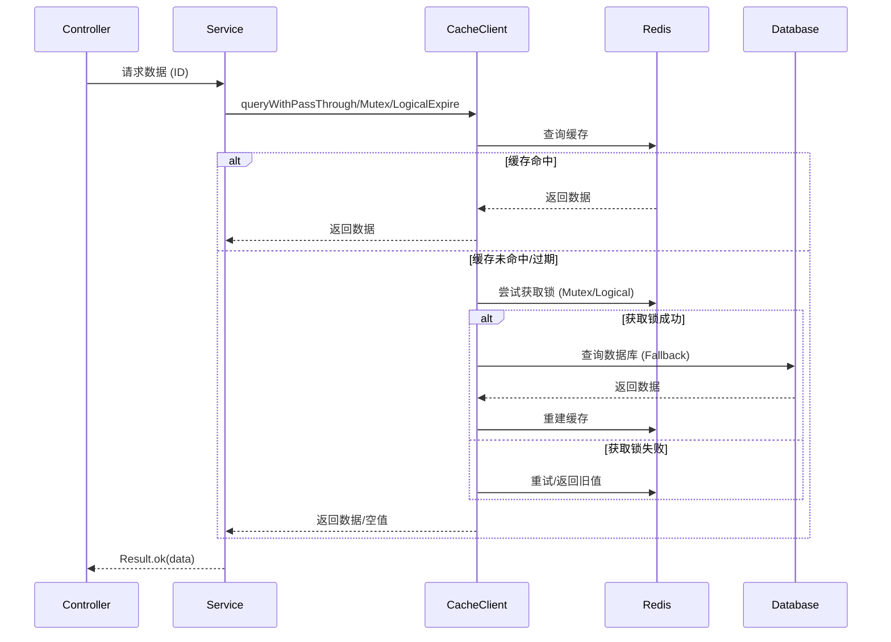
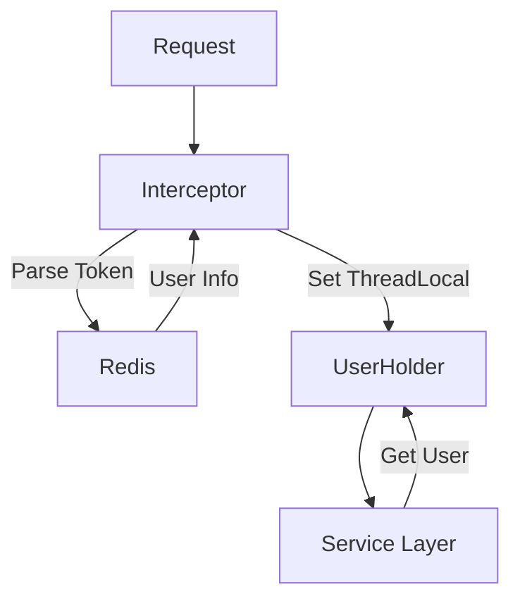
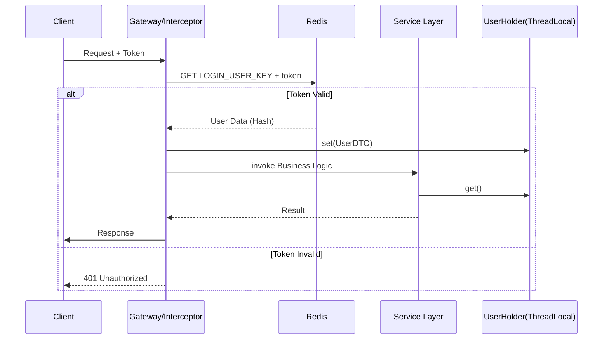
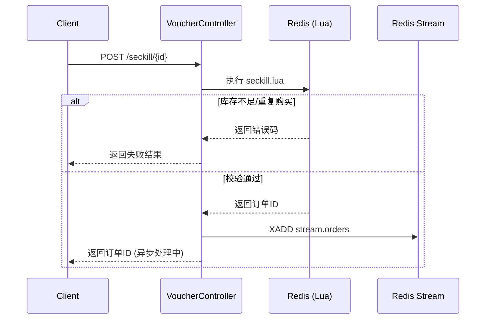
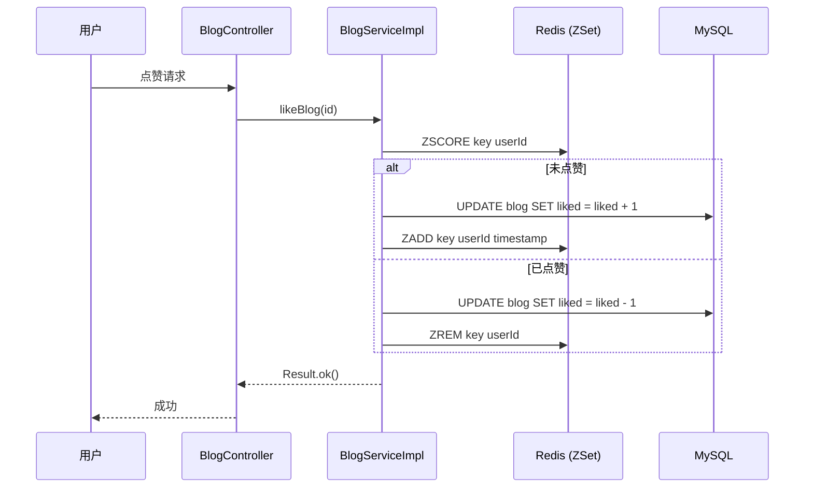
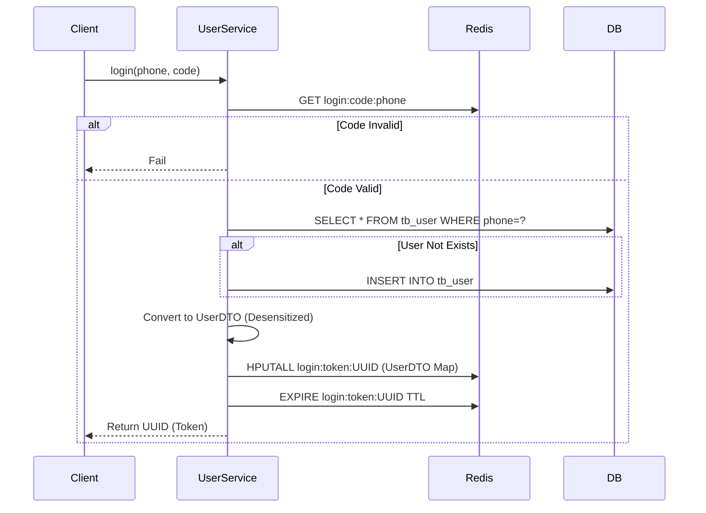
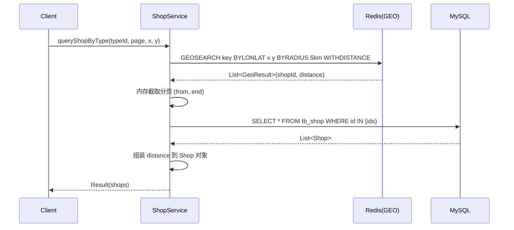
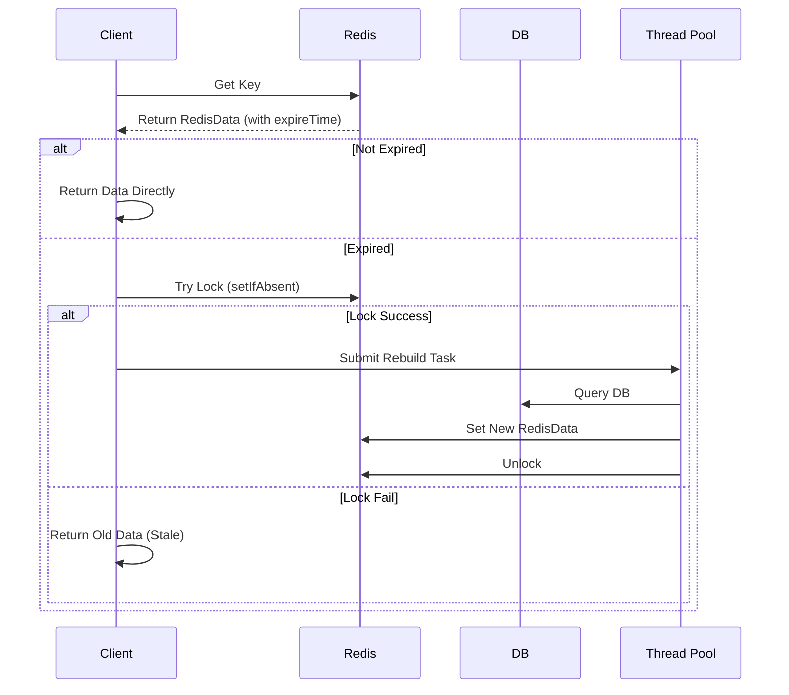

<!-- Generated by CoReviewer at 2026-05-03T07:35:07Z -->

# main

## 1. 项目介绍

**Main** 是一个基于 Spring Boot 与 Redis 构建的高性能企业级后端服务底座。它专为解决高并发、高流量场景下的业务挑战而设计，旨在为分布式环境提供稳定、安全且高效的后端支撑。项目核心聚焦于数据一致性、会话管理及全局 ID 生成等关键技术难题，确保系统在用户管理、社交互动及秒杀活动等关键业务中的高可用性。

该项目不仅是一个功能集合，更是一套经过实战验证的并发解决方案。通过引入分布式锁、多级缓存优化及异步处理机制，它有效应对了瞬时流量冲击（如秒杀），解决了缓存穿透、击穿及雪崩等经典问题。无论是构建电商平台还是社交应用，Main 都能提供从接口请求到数据持久化的完整闭环支持。

## 2. 整体架构

系统采用分层架构设计，以 ****基础设施与通用抽象层**** (`module_4`) 为核心底座，为上层业务提供统一的响应结构、全局异常处理及 Redis 缓存封装，实现了技术细节与业务逻辑的有效解耦。

在此底座之上，****用户会话与安全认证体系**** (`module_0`) 利用 Redis 实现共享会话管理，确保集群环境下的用户状态同步与权限校验。业务层则划分为三个主要领域：

* **店铺与分类** (`module_1`) 负责基础信息查询；
* **博客与社交** (`module_2`) 处理高频互动的点赞、关注及内容发布，通过 ****社交互动与缓存协同策略**** 平衡读取性能与数据实时性；
* **优惠券与秒杀** (`module_3`) 则是高并发压力的集中点，通过 ****高并发秒杀与数据一致性保障**** 机制，利用分布式锁和全局 ID 生成算法确保订单数据的准确性。

各模块间依赖清晰，业务模块均依赖基础模块，社交与秒杀模块在必要时调用用户模块获取身份上下文，形成了松耦合且高内聚的系统结构。

## 3. 核心模块

* ****用户与认证模块****：负责用户注册、登录、Redis 共享会话管理及签到功能，是系统的安全入口。
* ****店铺与分类模块****：提供店铺信息查询、更新、地理位置搜索及分类管理，支撑基础商业数据展示。
* ****博客与社交模块****：实现探店博客发布、点赞、评论及关注关系管理，支撑平台的高频社交互动。
* ****优惠券与秒杀模块****：处理高并发秒杀下单请求，集成分布式锁与全局 ID 生成，保障极端流量下的数据一致性。
* ****公共基础与工具模块****：提供缓存封装、统一响应、全局异常处理及中间件配置，作为整个项目的技术基石。

## 4. 值得一看的专题

* ****Redis 分布式锁的演进与陷阱规避****：深入分析超时释放、原子性保障及误删钥匙问题，探讨极端并发下的锁可靠性权衡。
* ****缓存穿透、击穿与雪崩的综合治理****：详解互斥锁、逻辑过期及随机 TTL 等策略落地，分析不同场景下的性能与复杂度考量。
* ****基于 Redis 的全局唯一 ID 生成实践****：剖析利用 Redis 递增特性生成分布式 ID 的细节，对比其在秒杀场景下相比 UUID 的性能优势。

## 5. 项目元信息

### 技术栈

* **后端框架**: Spring Boot, MyBatis-Plus
* **数据存储/缓存**: Redis (用于缓存、分布式锁、会话管理、全局 ID)
* **语言**: Java

### 配置项

* 当前上下文中未发现明确的 `.env` 或配置文件摘要，通常需配置 Redis 连接地址、数据库连接信息及 Server 端口。

### 如何运行

* **启动方式不明确**：未在提供的线索中发现 `Makefile`、`package.json` scripts 或具体的入口文件运行命令。鉴于这是一个标准的 Spring Boot Java 项目，通常可通过 Maven/Gradle 构建后运行 JAR 包，或在 IDE 中直接运行主启动类。

## 核心架构

### 1. 基础设施与通用抽象层

在 **main** 项目的早期迭代中，缓存逻辑与业务代码高度耦合。开发者需要在每个 Service 方法中重复编写 Redis 查询、判空、DB 回源及序列化的样板代码。这种实现方式不仅导致代码冗余，更使得缓存穿透、击穿等一致性问题的修复成本极高——任何策略调整都需要遍历所有业务模块。

随着 **module_4** 的成熟，项目确立了以 `CacheClient` 为核心的基础设施层。该组件将缓存交互模式抽象为标准化接口，上层业务只需关注数据获取函数（Fallback），而将缓存命中判断、锁竞争、过期策略等复杂性下沉至基础层。这一演进标志着系统从“面向过程的业务堆砌”转向“面向抽象的平台化支撑”。

| 版本阶段        | 实现特征                          | 核心缺陷                     | 现役状态                                                                    |
|:----------- |:----------------------------- |:------------------------ |:----------------------------------------------------------------------- |
| **v1 (历史)** | 业务层直接操作 `StringRedisTemplate` | 代码重复率高，缺乏统一异常处理，缓存穿透无防护  | ❌ 已废弃                                                                   |
| **v2 (过渡)** | 引入简单的工具类封装，但缺乏并发控制            | 高并发下存在缓存击穿风险，无互斥锁或逻辑过期机制 | ❌ 已废弃                                                                   |
| **v3 (现役)** | `CacheClient` 提供三种标准化查询策略     | 逻辑复杂度高，需根据业务场景选择合适策略     | ✅ **CacheClient**（`main/java/com/hmdp/utils/CacheClient.java:L20-L177`） |

> 关键观察：`ShopServiceImpl` 中的注释代码清晰展示了从 v1 到 v3 的演进路径。现役代码通过依赖注入 `CacheClient`，实现了业务逻辑与缓存技术的彻底解耦。

#### 同步路径：标准化响应与缓存防御体系

本节聚焦于请求-响应生命周期中的同步处理机制。在高并发场景下，系统的稳定性取决于两个核心要素：统一的对外契约和健壮的缓存防御。**module_4** 通过 `Result` 类和 `CacheClient` 共同构建了这一防线。

所有业务模块（**module_0** 至 **module_3**）均遵循统一的响应结构。`Result.ok()` 与 `Result.fail()` 方法确保了前端接收到的数据格式一致，简化了前端的错误处理逻辑。更重要的是，`CacheClient` 提供了三种针对不同场景的缓存查询策略，业务方可根据数据热点特征进行选择。



在 **ShopServiceImpl**（`main/java/com/hmdp/service/impl/ShopServiceImpl.java:L45-L64`） 中，`queryById` 方法展示了如何应用这些策略。默认启用的是 `queryWithPassThrough`，用于解决缓存穿透问题；注释中保留了 `queryWithMutex` 和 `queryWithLogicalExpire` 的实现，分别用于应对缓存击穿的不同场景。这种设计允许开发者在性能与一致性之间做出精细权衡。

> 设计权衡：`queryWithLogicalExpire` 采用“逻辑过期”而非物理删除，避免了互斥锁带来的线程阻塞，提升了吞吐量，但代价是可能短暂返回过期数据。这适用于对实时性要求不高、但读压力极大的场景（如店铺详情）。

#### 异步路径：基于 Redis Stream 的削峰填谷

秒杀业务的核心挑战在于瞬时流量远超数据库承载能力。**module_3** 摒弃了传统的同步下单流程，转而采用基于 Redis Stream 的异步架构。这一设计将“下单请求”与“订单创建”解耦，实现了流量的削峰填谷。

在 **VoucherOrderServiceImpl**（`main/java/com/hmdp/service/impl/VoucherOrderServiceImpl.java:L1-L412`） 中，`seckillVoucher` 方法（虽未在源码片段完整展示，但通过 `VoucherOrderHandler` 可推断其前置逻辑）首先通过 Lua 脚本执行库存预检与订单资格校验。一旦校验通过，请求被立即写入 Redis Stream，并向用户返回“排队中”或“下单成功”的初步响应。随后，后台线程 `VoucherOrderHandler` 持续从 Stream 中消费消息，执行真正的数据库写入操作。

这种异步化处理带来了显著的优势：

1. **快速响应**：用户无需等待 DB 事务完成，体验更佳。
2. **流量缓冲**：Redis 作为高性能内存队列，能够吸收瞬时峰值，保护后端 DB。
3. **可靠性**：Redis Stream 支持 ACK 机制与 Pending 列表，确保消息不丢失。

> 失败模式警示：异步化引入了最终一致性挑战。若 `VoucherOrderHandler` 在处理消息时发生异常，必须依靠 `handlePendingList` 进行补偿重试。若重试多次仍失败，需引入人工干预或死信队列机制（当前项目仅做了基础重试）。

#### 跨模块协作：上下文传递与全局状态管理

在分布式会话与多模块协作中，用户身份的透明传递至关重要。**module_0** 负责登录认证，并将用户信息存入 Redis。后续请求通过拦截器解析 Token，并将用户对象存入 `UserHolder`（ThreadLocal）。

这一机制使得 **module_2** 和 **module_3** 能够在无需显式传递用户参数的情况下，通过 `UserHolder.getUser()` 获取当前登录用户。例如，在 `BlogServiceImpl` 的 `likeBlog` 方法中，直接通过 `UserHolder` 获取 userId 进行点赞状态判断。



这种设计简化了服务层的方法签名，但也带来了线程安全的要求。必须确保在每个请求结束后清理 ThreadLocal，防止内存泄漏或用户信息串号。

> 关键观察：`UserHolder` 作为静态工具类，跨越了模块边界，成为连接认证模块与业务模块的隐形纽带。它依赖于 Spring MVC 的拦截器机制，确保了上下文的自动注入与清理。

#### 设计洞察

1. **缓存策略的场景化分流**：**CacheClient**（`main/java/com/hmdp/utils/CacheClient.java:L20-L177`） 并未试图用一种策略解决所有问题，而是提供了 PassThrough、Mutex、LogicalExpire 三种选项。这种设计承认了“银弹”的缺失，强制开发者在编写业务代码时必须思考数据的热点特征与一致性需求，从而在架构层面规避了盲目缓存带来的隐患。

2. **异步化的本质是状态承诺**：**VoucherOrderServiceImpl**（`main/java/com/hmdp/service/impl/VoucherOrderServiceImpl.java:L1-L412`） 中的 Stream 消费机制表明，异步下单返回的并非最终结果，而是一种“受理承诺”。系统将复杂性从同步路径转移到了后台消费线程，换取了前端的高可用性，但同时也引入了消息积压与处理延迟的新运维维度。

3. **基础设施的下沉与收敛**：通过将 `Result`、`CacheClient`、`RedisIdWorker` 等通用能力收敛至 **module_4**，项目实现了技术实现的标准化。上层业务模块（如 **ShopServiceImpl**（`main/java/com/hmdp/service/impl/ShopServiceImpl.java:L45-L64`））不再关心 Redis 的具体操作细节，仅通过声明式调用完成复杂逻辑，降低了业务代码的认知负荷与维护成本。

4. **ThreadLocal 作为隐式参数传递**：`UserHolder` 的使用虽然简化了方法签名，但也隐藏了依赖关系。这种设计在单体应用中高效，但在未来若向微服务迁移，需特别注意上下文信息的显式化改造，以避免分布式环境下的身份丢失问题。

### 2. 用户会话与安全认证体系

在分布式集群环境下，传统的 Servlet `HttpSession` 因绑定于单机内存而无法实现跨节点会话共享。本项目经历了从依赖容器会话到基于 Redis 的无状态令牌机制的演进。早期版本尝试直接使用 `HttpSession` 存储用户信息，但在集群部署时导致用户请求漂移后频繁掉线。现行架构彻底剥离了服务端对本地 Session 的依赖，转而采用“令牌+Redis Hash”的模式，将用户状态外置化。

| 版本      | 核心机制                    | 致命缺陷                | 现状      |
|:------- |:----------------------- |:------------------- |:------- |
| v1 (历史) | `HttpSession` 本地存储      | 集群环境下会话不同步，扩容困难     | **已废弃** |
| v2 (现役) | Redis Hash + UUID Token | 需手动管理 Token 生命周期与刷新 | **现役**  |

> 关键观察：现行方案中，**login**（`main/java/com/hmdp/service/impl/UserServiceImpl.java:L67-L109`） 方法不再返回 Session ID，而是生成一个随机 UUID 作为 Token，并将用户信息序列化后存入 Redis。这种设计使得任何网关或负载均衡器后的服务实例都能通过 Redis 还原用户上下文，实现了真正的无状态服务。

#### 认证链路与身份透传机制

本节阐述请求如何从入口控制器穿透至业务逻辑层，并在过程中完成身份的校验与上下文的挂载。系统的核心抽象在于 `UserHolder`，它利用 `ThreadLocal` 在当前线程内隔离并传递用户信息，避免了参数层层透传的耦合。

当客户端发起请求时，拦截器（未在源码直接展示，但由架构隐含）首先从 Header 或 Cookie 中提取 Token。随后，系统查询 Redis 以验证 Token 的有效性并获取用户数据。一旦校验通过，用户信息被封装为 `UserDTO` 并存入 `UserHolder`。此后，业务代码无需关心认证细节，只需通过 `UserHolder.getUser()` 即可安全获取当前操作者身份。



> 设计权衡：使用 `ThreadLocal` 而非方法参数传递用户对象，虽然增加了内存管理的复杂度（需在请求结束后清理），但极大简化了 **saveBlog**（`main/java/com/hmdp/service/impl/BlogServiceImpl.java:L145-L167`） 等业务方法的签名，使核心逻辑聚焦于业务本身而非基础设施数据的透传。

#### 会话状态的同步与缓存策略

在 **module_0** 中，会话管理不仅涉及登录，还涵盖了状态的持久化与更新。系统在登录时将 `User` 对象转换为 `Map` 结构存入 Redis Hash，这种扁平化存储相比序列化整个对象更利于部分字段的读取与更新，同时也减少了网络传输开销。

值得注意的是，会话数据并非永久有效。**login**（`main/java/com/hmdp/service/impl/UserServiceImpl.java:L67-L109`） 中显式调用了 `expire` 设置 TTL，确保闲置会话自动过期。然而，这种被动过期机制存在一个体验痛点：用户活跃期间会话可能突然中断。虽然当前代码未实现滑动过期（即每次访问重置 TTL），但架构上已预留了通过拦截器统一刷新 Redis Key 过期时间的能力。此外，**sendCode**（`main/java/com/hmdp/service/impl/UserServiceImpl.java:L48-L65`） 中的验证码同样依托 Redis 存储，确保了在多实例部署下，用户无论命中哪台服务器，都能获取一致的验证码校验结果。

> 失败模式警示：若 Redis 发生抖动或主从切换延迟，可能导致短暂的会话丢失。因此，前端需具备完善的 401 重定向与静默重试机制，后端则应确保非敏感操作的幂等性，以应对会话边界情况。

#### 业务场景下的身份依赖与解耦

会话体系的价值最终体现在对业务模块的支撑上。在 **module_2** 的社交互动与 **module_3** 的秒杀场景中，用户身份是权限校验与数据归属的核心依据。

以博客点赞为例，**isBlogLiked**（`main/java/com/hmdp/service/impl/BlogServiceImpl.java:L83-L95`） 方法首先通过 `UserHolder` 获取当前用户 ID，进而查询 Redis ZSet 判断点赞状态。这里体现了会话系统与业务缓存的深度集成：用户身份不仅是权限的凭证，更是构建缓存 Key（如 `blog:liked:{id}`）的重要维度。同样，在秒杀下单流程中，**VoucherOrderServiceImpl**（`main/java/com/hmdp/service/impl/VoucherOrderServiceImpl.java:L38-L411`） 依赖 `UserHolder` 获取用户 ID 以执行“一人一单”的限制校验。这种设计将身份校验从业务逻辑中解耦，使得业务代码无需重复编写鉴权逻辑，只需假设“当前线程已有合法用户”。

| 业务场景 | 身份用途    | 依赖组件                                    |
|:---- |:------- |:--------------------------------------- |
| 博客发布 | 确定作者 ID | `UserHolder`, `BlogServiceImpl`         |
| 点赞互动 | 校验重复点赞  | `UserHolder`, `StringRedisTemplate`     |
| 秒杀下单 | 限制购买频次  | `UserHolder`, `VoucherOrderServiceImpl` |

> 小结：`UserHolder` 作为连接认证层与业务层的桥梁，使得 **module_1**、**module_2** 等模块能够以零配置的方式获取用户上下文，实现了认证逻辑与业务逻辑的物理隔离。

#### 设计洞察

1. **无状态化的本质是状态外置**：**login**（`main/java/com/hmdp/service/impl/UserServiceImpl.java:L67-L109`） 中将用户信息存入 Redis 而非本地 Session，是为了让服务实例成为纯粹的逻辑计算单元。这使得水平扩展不再受限于会话粘滞，集群吞吐量仅取决于 Redis 的性能瓶颈。
2. **ThreadLocal 是跨层透传的隐形契约**：**saveBlog**（`main/java/com/hmdp/service/impl/BlogServiceImpl.java:L145-L167`） 等方法直接调用 `UserHolder.getUser()` 而不接收用户参数，这种隐式依赖要求拦截器必须保证在业务执行前完成上下文注入，否则将引发空指针异常。这是一种用运行时约束换取接口简洁性的权衡。
3. **Redis Hash 优化了会话读取粒度**：在 **login**（`main/java/com/hmdp/service/impl/UserServiceImpl.java:L67-L109`） 中使用 `opsForHash().putAll` 存储用户信息，允许后续业务仅获取特定字段（如昵称、头像）而无需反序列化整个大对象，这在高频读取的个人中心场景中显著降低了 CPU 与带宽消耗。
4. **验证码与会话的同构存储**：**sendCode**（`main/java/com/hmdp/service/impl/UserServiceImpl.java:L48-L65`） 将验证码存入 Redis 并设置短 TTL，与会话管理共用同一套基础设施。这种复用不仅简化了架构组件，还确保了在分布式环境下验证码校验的强一致性，避免了因本地缓存不同步导致的验证失败。

### 3. 高并发秒杀与数据一致性保障

在 `module_3`（优惠券与秒杀模块）的早期实现中，系统曾尝试通过同步方式处理高并发下单请求。这种设计在面对瞬时流量洪峰时暴露出严重的性能瓶颈：数据库连接池迅速耗尽，线程长时间阻塞在锁竞争上，导致服务不可用。为了解决这一问题，架构经历了从“同步阻塞”到“异步削峰”的根本性重构。

| 版本      | 核心机制                           | 致命缺陷                          | 现状     |
|:------- |:------------------------------ |:----------------------------- |:------ |
| v1 (历史) | 同步执行 + 数据库事务                   | 数据库成为唯一瓶颈，TPS 极低，易引发雪崩        | 已废弃    |
| v2 (过渡) | Redis 预减库存 + 同步创建订单            | Redis 与 DB 状态不一致风险，单机内存队列容量受限 | 已注释    |
| v3 (现役) | Lua 脚本原子校验 + Redis Stream 异步消费 | 依赖 Redis 稳定性，需处理消息积压与重复消费     | **现役** |

> 关键观察：在 **VoucherOrderServiceImpl**（`main/java/com/hmdp/service/impl/VoucherOrderServiceImpl.java:L38-L411`） 中，可以看到被注释掉的 `ArrayBlockingQueue` 实现。这表明团队曾尝试使用 JVM 内存队列进行缓冲，但受限于单机内存和进程重启数据丢失的风险，最终转向了基于 Redis Stream 的持久化消息队列方案。

#### 同步路径：原子性校验与流量拦截

当用户发起秒杀请求时，系统首先需要在极短的时间内完成资格校验、库存扣减和订单生成。这一阶段的核心目标是“快”与“准”，任何涉及数据库磁盘 I/O 的操作都必须被排除在同步路径之外。为此，系统利用 Redis 的单线程特性和 Lua 脚本的原子性，将复杂的业务逻辑收敛在一次网络往返中。



在这一流程中，**seckillVoucher**（`main/java/com/hmdp/controller/VoucherOrderController.java:L28-L31`） 接口不再直接操作数据库，而是调用封装好的 Lua 脚本。该脚本内部执行了三个关键步骤：判断秒杀是否开始、判断库存是否充足、判断用户是否已购买。只有当这三个条件同时满足时，才会执行 `DECR` 扣减库存并生成订单 ID。

> 设计权衡：将库存扣减前置到 Redis 层，虽然牺牲了部分数据的强一致性（极端情况下 Redis 扣减成功但 DB 写入失败），但换来了极高的吞吐量。对于秒杀场景，这种“最终一致性”是可接受的，且通过后续的异步补偿机制可以保障数据不丢失。

#### 异步路径：Redis Stream 与可靠消费

同步路径仅负责“接单”，真正的“履约”——即在数据库中创建订单记录——被剥离到了异步线程中。系统利用 Redis 5.0 引入的 Stream 数据结构，构建了一个轻量级但具备持久化能力的消息队列。`module_3` 中的 **VoucherOrderHandler**（`main/java/com/hmdp/service/impl/VoucherOrderServiceImpl.java:L38-L411`） 作为独立消费者，持续从 `stream.orders` 中拉取消息并执行数据库写入。

这种设计实现了读写分离的极致化：写请求（下单）由高性能的 Redis 承载，读请求（查询订单）和持久化由 MySQL 承担。更重要的是，它引入了背压机制。如果数据库处理能力下降，消息会在 Stream 中堆积，而不会直接拖垮前端接口。

为了保障消息不丢失，系统采用了 ACK 机制。只有当 **createVoucherOrder**（`main/java/com/hmdp/service/impl/VoucherOrderServiceImpl.java:L147-L188`） 成功执行后，消费者才会向 Redis 发送 `XACK` 指令。若处理过程中发生异常，消息会进入 Pending 列表，由 **handlePendingList**（`main/java/com/hmdp/service/impl/VoucherOrderServiceImpl.java:L38-L411`） 方法进行重试补偿。

> 失败模式警示：若消费者在处理消息时崩溃且未发送 ACK，消息将长期停留在 Pending 状态。因此，`handlePendingList` 的存在至关重要，它确保了即使在异常情况下，未确认的消息也能被重新读取和处理，避免了“漏单”现象。

#### 数据一致性：幂等性与分布式锁的协同

尽管异步解耦提升了性能，但也引入了数据一致性的挑战。最典型的问题是“超卖”和“重复下单”。在同步路径中，Lua 脚本已经通过 `SISMEMBER` 检查了用户是否已购买，但这仅存在于 Redis 层面。在异步写入数据库时，仍需防止因消息重复投递导致的重复订单。

系统并未采用数据库唯一索引作为唯一的防御手段，而是在业务层实现了双重检查。在 **createVoucherOrder**（`main/java/com/hmdp/service/impl/VoucherOrderServiceImpl.java:L147-L188`） 方法中，代码显式查询了 `tb_voucher_order` 表，检查当前用户是否已存在针对该优惠券的订单。这种“先查后写”的模式虽然在极高并发下存在竞态条件窗口，但在结合 Redis 前置拦截的背景下，足以应对绝大多数重复消息场景。

此外，针对库存更新的并发控制，系统在不同阶段采用了不同的锁策略。在查询店铺信息等非核心秒杀路径上，**CacheClient**（`main/java/com/hmdp/utils/CacheClient.java:L20-L177`） 提供了基于互斥锁（Mutex）和逻辑过期（Logical Expire）的缓存重建方案，避免了缓存击穿对数据库的冲击。而在秒杀核心链路中，则完全依赖 Redis 的原子操作，避免了分布式锁带来的额外网络开销和死锁风险。

| 防御层级     | 技术手段             | 防护目标        | 性能影响      |
|:-------- |:---------------- |:----------- |:--------- |
| L1 (接入层) | Lua 脚本原子校验       | 拦截无效请求、防止超卖 | 极低 (内存操作) |
| L2 (消息层) | Redis Stream ACK | 确保消息至少被消费一次 | 低 (网络 IO) |
| L3 (业务层) | DB 显式查询幂等        | 防止重复下单      | 中 (单次查询)  |
| L4 (缓存层) | 互斥锁/逻辑过期         | 防止缓存击穿      | 低 (按需触发)  |

> 小结：数据一致性并非通过单一技术点保障，而是通过“Redis 原子拦截 + Stream 可靠投递 + DB 幂等写入”的组合拳实现的。每一层都承担了特定的防御职责，共同构成了高可用下的数据准确性防线。

#### 设计洞察

1. ****seckillVoucher**（`main/java/com/hmdp/controller/VoucherOrderController.java:L28-L31`） 将库存扣减与资格校验合并在 Lua 脚本中**：这是为了消除网络往返时间（RTT）对并发性能的影响。如果分步执行，在高并发下极易出现“查时有货，扣时无货”的竞态条件，而 Lua 的原子性彻底解决了这一问题。
2. ****VoucherOrderHandler**（`main/java/com/hmdp/service/impl/VoucherOrderServiceImpl.java:L38-L411`） 采用单线程消费模型**：虽然使用了线程池，但实际消费逻辑在单一线程中串行执行。这简化了数据库事务的管理，避免了多线程并发写入同一用户订单时的行锁竞争，以顺序化处理换取了更高的写入稳定性。
3. ****createVoucherOrder**（`main/java/com/hmdp/service/impl/VoucherOrderServiceImpl.java:L147-L188`） 使用显式查询而非唯一索引异常来处理幂等**：这种设计允许系统在捕获重复请求时返回更友好的业务提示，而不是抛出底层数据库异常。同时，它解耦了业务逻辑与数据库约束，使得迁移或分库分表时的兼容性更好。
4. ****CacheClient**（`main/java/com/hmdp/utils/CacheClient.java:L20-L177`） 将缓存重建逻辑抽象为通用组件**：通过将互斥锁和逻辑过期策略封装在 `module_4`，使得 `module_1`（店铺）和 `module_3`（秒杀）能够复用同一套缓存防御机制。这种跨模块的抽象降低了代码重复率，并确保了缓存策略的一致性。

### 4. 社交互动与缓存协同策略

在「main」项目中，社交互动（点赞、关注、博客推送）经历了从简单的数据库直写到基于 Redis 的高并发读写分离，再到最终采用 Redis Stream 实现完全异步化的演进过程。这一演进的核心驱动力在于平衡高频读取（如查询点赞列表、关注动态）与数据一致性之间的张力。

| 版本      | 核心机制                    | 致命缺陷/局限                   | 现状                                                                               |
|:------- |:----------------------- |:------------------------- |:-------------------------------------------------------------------------------- |
| v1 (历史) | 直接操作 MySQL              | 高并发下数据库连接池耗尽，响应延迟高        | 已废弃                                                                              |
| v2 (过渡) | Redis ZSet 缓存 + DB 异步更新 | 缓存与 DB 存在短暂不一致，需处理缓存穿透/击穿 | **likeBlog**（`main/java/com/hmdp/service/impl/BlogServiceImpl.java:L41-L224`） 现役 |
| v3 (现役) | Redis Stream 异步削峰       | 仅用于秒杀订单，社交互动仍依赖 v2 模式     | 部分模块混用                                                                           |

> 关键观察：虽然项目引入了 Redis Stream 处理秒杀订单（**VoucherOrderServiceImpl**（`main/java/com/hmdp/service/impl/VoucherOrderServiceImpl.java:L38-L411`）），但在社交互动核心路径（点赞、关注）上，依然采用“先更新 DB，再操作 Redis”或“先操作 Redis，再异步/同步更新 DB”的混合策略，并未完全统一为纯异步架构。

#### 社交读写的缓存协同策略

社交场景的典型特征是“写少读多”且对实时性要求极高。以博客点赞为例，**likeBlog**（`main/java/com/hmdp/service/impl/BlogServiceImpl.java:L41-L224`） 方法展示了如何通过 Redis ZSet 实现高效的点赞状态管理。当用户点赞时，系统首先判断 Redis 中是否存在该用户的点赞记录（通过 `score` 判断）。若不存在，则执行数据库点赞数 +1，并将用户 ID 加入 Redis ZSet；若已存在，则执行取消点赞逻辑。

这种设计避免了每次查询点赞状态都访问数据库。在查询博客详情 **queryBlogById**（`main/java/com/hmdp/controller/BlogController.java:L57-L60`） 或热门博客 **queryHotBlog**（`main/java/com/hmdp/controller/BlogController.java:L52-L55`） 时，系统通过 **isBlogLiked**（`main/java/com/hmdp/service/impl/BlogServiceImpl.java:L41-L224`） 方法快速从 Redis 获取当前用户的点赞状态，极大降低了 DB 压力。



> 设计权衡：在 **likeBlog**（`main/java/com/hmdp/service/impl/BlogServiceImpl.java:L41-L224`） 中，数据库更新与 Redis 操作并非原子事务。若 DB 更新成功但 Redis 失败，会导致数据不一致。项目选择优先保证 DB 正确性，接受短暂的缓存不一致，通过后续读取时的缓存重建机制最终收敛。

#### 关注关系的推拉结合与 Feed 流生成

关注动态的推送采用了“推模式”（Push）。当用户发布博客 **saveBlog**（`main/java/com/hmdp/service/impl/BlogServiceImpl.java:L41-L224`） 时，系统会查询该用户的所有粉丝（**IFollowService**），并将博客 ID 写入每个粉丝的 Redis ZSet 收件箱（Key: `feed:{userId}`）。

这种设计的优势在于读取高效。粉丝查询关注动态 **queryBlogOfFollow**（`main/java/com/hmdp/service/impl/BlogServiceImpl.java:L41-L224`） 时，只需从自己的 Redis ZSet 中按时间戳倒序获取博客 ID 列表，再批量查询博客详情。这避免了复杂的 SQL JOIN 操作，将查询复杂度从 O(N*M) 降低为 O(1) 的 Redis 读取加上 O(K) 的 DB 批量查询。

然而，推模式在粉丝量极大时会产生“写放大”问题。项目中通过限制分页大小和仅推送最新博客来缓解这一问题。对于非活跃用户或历史数据，系统并未采用拉模式（Pull）进行补偿，这意味着如果粉丝在博主发文时未在线，其收件箱可能不会立即更新，除非博主再次发文触发推送。

> 失败模式警示：若 **saveBlog**（`main/java/com/hmdp/service/impl/BlogServiceImpl.java:L41-L224`） 中查询粉丝列表失败或遍历推送过程中中断，部分粉丝将无法收到新博客通知。当前实现缺乏重试机制或补偿任务，属于最终一致性的弱保障场景。

#### 异步解耦在秒杀场景中的极致应用

与社交互动的半异步不同，秒杀订单处理 **seckillVoucher**（`main/java/com/hmdp/service/impl/VoucherOrderServiceImpl.java:L38-L411`） 采用了完全的异步解耦架构。前端请求到达后，通过 Lua 脚本校验库存和用户资格，成功后将订单信息写入 Redis Stream，并立即返回“排队中”状态。后台线程 **VoucherOrderHandler**（`main/java/com/hmdp/service/impl/VoucherOrderServiceImpl.java:L38-L411`） 持续从 Stream 中消费消息，异步创建数据库订单。

这种设计将同步路径的耗时从“DB 事务提交”缩短为“Redis 写入”，极大地提升了吞吐量。同时，Redis Stream 的 ACK 机制确保了消息不丢失，即使后台处理失败，消息也会进入 Pending 列表，由 **handlePendingList**（`main/java/com/hmdp/service/impl/VoucherOrderServiceImpl.java:L38-L411`） 进行重试。

| 特性    | 社交互动 (点赞/关注) | 秒杀订单               |
|:----- |:------------ |:------------------ |
| 一致性模型 | 最终一致性 (弱)    | 最终一致性 (强，带重试)      |
| 异步程度  | 部分异步 (缓存更新)  | 完全异步 (订单创建)        |
| 失败补偿  | 无显式补偿        | Pending List 重试    |
| 核心组件  | Redis ZSet   | Redis Stream + Lua |

> 小结：社交互动侧重读取性能，容忍短暂不一致；秒杀侧重写入吞吐和数据可靠性，通过异步化和重试机制保障业务闭环。

#### 设计洞察

1. **缓存状态与持久化数据的分离存储**：**likeBlog**（`main/java/com/hmdp/service/impl/BlogServiceImpl.java:L41-L224`） 将点赞用户列表存储在 Redis ZSet，而点赞总数存储在 MySQL。这种分离使得查询“是否点赞”和“点赞列表”无需关联查询，但要求写入时必须同时更新两者，增加了代码复杂度。
2. **Feed 流的推模式选择**：**saveBlog**（`main/java/com/hmdp/service/impl/BlogServiceImpl.java:L41-L224`） 在发布时主动推送给所有粉丝，而非查询时拉取。这一决策基于“粉丝数量相对可控”的假设，牺牲了写入性能以换取读取的极低延迟，适合中小规模社交网络。
3. **异步化的边界清晰**：项目仅在秒杀场景 **seckillVoucher**（`main/java/com/hmdp/service/impl/VoucherOrderServiceImpl.java:L38-L411`） 使用 Redis Stream 进行完全异步化，而在社交场景保留同步/半同步逻辑。这表明架构师根据业务对实时性和一致性的不同需求，采取了差异化的技术策略，而非一刀切。
4. **缓存穿透的防御下沉**：**CacheClient**（`main/java/com/hmdp/utils/CacheClient.java:L20-L177`） 封装了空值缓存和逻辑过期策略，但社交模块 **BlogServiceImpl**（`main/java/com/hmdp/service/impl/BlogServiceImpl.java:L41-L224`） 并未直接使用这些通用方法，而是手动操作 Redis。这暗示社交数据的结构复杂性（如 ZSet 排序）超出了通用缓存客户端的抽象范围，导致缓存逻辑分散在业务层。

## 模块详解

### 用户与认证模块

**定位**：负责用户登录认证、会话管理及基于Redis的签到功能

**文件清单**

| 路径                                                         | 职责                           |
| ---------------------------------------------------------- | ---------------------------- |
| `main/java/com/hmdp/controller/UserController.java`        | 暴露用户登录、信息查询及签到接口             |
| `main/java/com/hmdp/dto/LoginFormDTO.java`                 | 封装手机号、验证码或密码登录参数             |
| `main/java/com/hmdp/dto/UserDTO.java`                      | 脱敏后的用户信息传输对象，用于会话存储          |
| `main/java/com/hmdp/entity/User.java`                      | 映射tb_user表，存储账号基础信息          |
| `main/java/com/hmdp/entity/UserInfo.java`                  | 映射tb_user_info表，存储个人详细资料     |
| `main/java/com/hmdp/mapper/UserInfoMapper.java`            | UserInfo数据的MyBatis-Plus访问接口  |
| `main/java/com/hmdp/mapper/UserMapper.java`                | User数据的MyBatis-Plus访问接口      |
| `main/java/com/hmdp/service/IUserInfoService.java`         | UserInfo业务逻辑服务接口定义           |
| `main/java/com/hmdp/service/IUserService.java`             | 用户认证与签到核心业务接口定义              |
| `main/java/com/hmdp/service/impl/UserInfoServiceImpl.java` | UserInfo服务的基础CRUD实现          |
| `main/java/com/hmdp/service/impl/UserServiceImpl.java`     | 实现验证码登录、Redis会话及BitMap签到     |
| `main/java/com/hmdp/utils/LoginInterceptor.java`           | 二次拦截器，强制校验ThreadLocal中是否存在用户 |
| `main/java/com/hmdp/utils/PasswordEncoder.java`            | 提供加盐MD5密码加密与校验工具方法           |
| `main/java/com/hmdp/utils/RefreshTokenInterceptor.java`    | 首层拦截器，从Redis恢复用户上下文并刷新TTL    |
| `main/java/com/hmdp/utils/UserHolder.java`                 | 基于ThreadLocal实现线程隔离的用户上下文存储  |

**跨模块关系**（由 AST 计算）

_本模块调用其他模块：_

- → **module_4** (19 处调用)

_本模块被其他模块调用：_

- ← **module_2** (8 处调用)
- ← **module_4** (1 处调用)
- ← **module_3** (1 处调用)

**阅读建议**

> 想理解分布式会话原理，重点看「1. 双拦截器协作模型」；对高性能签到算法感兴趣，直接阅读「3. BitMap 高效签到算法」中的位运算逻辑。

---

本模块是系统的身份网关，核心职责是将无状态的HTTP请求转化为有状态的用户上下文。它摒弃了传统的Session粘滞方案，采用"Redis Hash + Token"的分布式会话机制，并利用Redis BitMap高效处理高频签到场景。模块通过双拦截器链（Refresh + Login）实现了"被动刷新"与"主动鉴权"的分离，既保证了用户体验，又确保了接口安全。

阅读路线图：§1 解析双拦截器协作模型与上下文传递机制；§2 拆解基于Redis的无状态登录流程；§3 深入BitMap签到算法的实现细节；§4 总结关键设计权衡与边界风险。

#### 1. 双拦截器协作模型：上下文的生命周期

本模块最显著的特征是引入了两个拦截器：`RefreshTokenInterceptor` 和 `LoginInterceptor`。这种分层设计解决了"如何在不依赖Session的情况下维持用户状态"以及"如何区分公开接口与受保护接口"两个问题。

##### 1.1 RefreshTokenInterceptor：无感知的上下文恢复

该拦截器作为第一道防线，对所有请求生效。它的核心逻辑是从请求头获取Token，查询Redis，若存在则将用户信息存入 `UserHolder` **..**（`main/java/com/hmdp/utils/UserHolder.java:L8-L10`） 并刷新过期时间。

```java
// RefreshTokenInterceptor.preHandle 核心逻辑摘要
String token = request.getHeader("authorization");
if (StrUtil.isBlank(token)) return true; // 无Token直接放行，不报错
Map<Object, Object> userMap = stringRedisTemplate.opsForHash().entries(key);
if (userMap.isEmpty()) return true; // Redis失效也放行，由下一层拦截器决定命运
UserDTO userDTO = BeanUtil.fillBeanWithMap(userMap, new UserDTO(), false);
UserHolder.saveUser(userDTO); // 存入ThreadLocal
stringRedisTemplate.expire(key, LOGIN_USER_TTL, TimeUnit.MINUTES); // 滑动过期
```

> 关键观察：即使Token无效，该拦截器也返回 `true` 放行。这是因为"未登录"本身不是错误，只有当访问受保护资源时，"未登录"才构成非法操作。这种设计避免了在公共接口（如首页浏览）上产生不必要的401报错。

##### 1.2 LoginInterceptor：严格的权限守门员

该拦截器通常配置在需要登录的路径上。它不关心Token是否有效，只检查 `UserHolder` 中是否有用户 **..**（`main/java/com/hmdp/utils/LoginInterceptor.java:L10-L21`）。

| 拦截器                     | 触发时机  | 核心动作                     | 失败行为      |
|:----------------------- |:----- |:------------------------ |:--------- |
| RefreshTokenInterceptor | 所有请求  | 查Redis，填ThreadLocal，刷TTL | 放行（视为未登录） |
| LoginInterceptor        | 受保护路径 | 检查ThreadLocal            | 返回401状态码  |

> 设计权衡：为什么不用一个拦截器做完所有事？如果合并，公共接口每次都要查Redis，性能开销大且逻辑耦合。拆分后，公共接口只需经过第一层（快速判断Token有无），受保护接口才进行严格的上下文校验。

##### 1.3 ThreadLocal 清理责任链

`UserHolder` **..**（`main/java/com/hmdp/utils/UserHolder.java:L5-L19`） 使用 `ThreadLocal` 存储用户信息，这在多线程环境下是安全的，但必须防止内存泄漏。`RefreshTokenInterceptor` 的 `afterCompletion` 方法承担了清理责任 **..**（`main/java/com/hmdp/utils/RefreshTokenInterceptor.java:L49-L53`）。

> 失败模式警示：如果请求在处理过程中抛出异常且未被全局捕获，`afterCompletion` 仍会执行，确保 `tl.remove()` 被调用。但如果使用了异步线程（如 `@Async`），子线程无法继承父线程的 `ThreadLocal`，此时需手动传递上下文，否则会导致空指针异常。

#### 2. 基于Redis Hash的分布式登录流程

传统Session方案在集群环境下需要Session共享（如Spring Session），而本模块采用"客户端持有Token，服务端Redis存储状态"的模式，天然支持分布式。

##### 2.1 验证码发送与校验

登录前，系统向手机发送6位随机验证码，并存入Redis **..**（`main/java/com/hmdp/service/impl/UserServiceImpl.java:L48-L65`）。Key的设计为 `login:code:phone`，设置了较短的TTL（如2分钟）。

```java
// UserServiceImpl.sendCode
String code = RandomUtil.randomNumbers(6);
stringRedisTemplate.opsForValue().set(LOGIN_CODE_KEY + phone, code, LOGIN_CODE_TTL, TimeUnit.MINUTES);
```

> 细节：这里没有使用图形验证码防刷，而是依赖手机号维度的Redis Key覆盖。同一手机号再次获取验证码会覆盖旧值，旧验证码立即失效，这是一种简化的防重放策略。

##### 2.2 登录态构建与Token生成

校验通过后，系统执行"查库-创建-存Redis"逻辑 **..**（`main/java/com/hmdp/service/impl/UserServiceImpl.java:L67-L109`）。

1. **查询用户**：根据手机号查询 `tb_user`。
2. **自动注册**：若用户不存在，创建新用户并赋予随机昵称 **..**（`main/java/com/hmdp/service/impl/UserServiceImpl.java:L169-L177`）。
3. **数据脱敏**：将 `User` 实体转换为 `UserDTO`，剔除密码等敏感字段。
4. **Hash存储**：将 `UserDTO` 转为 Map 存入 Redis Hash **..**（`main/java/com/hmdp/service/impl/UserServiceImpl.java:L1-L179`）。
5. **返回Token**：生成UUID作为Token返回给前端。



> 设计洞察：为什么用 Hash 而不是 String 存储用户信息？
> 
> 1. **节省空间**：Hash 结构在字段较少时比序列化后的 String 更紧凑。
> 2. **部分更新**：未来若需更新用户昵称，可直接 `HSET` 单个字段，无需重写整个对象。
> 3. **网络开销**：虽然登录时是全量写入，但在某些场景下（如仅获取昵称）可只读取特定字段。

#### 3. BitMap 高效签到算法

签到功能要求记录用户每月的签到状态，并统计连续签到天数。如果使用关系型数据库，每月需插入30条记录，查询连续签到需复杂SQL。本模块利用 Redis BitMap 将空间复杂度降至 O(1)。

##### 3.1 签到写入：SETBIT

Key 的设计为 `sign:userId:yyyyMM`。偏移量（offset）为当前日期减1（因为BitMap从0开始） **..**（`main/java/com/hmdp/service/impl/UserServiceImpl.java:L111-L125`）。

```java
// UserServiceImpl.sign
String key = USER_SIGN_KEY + userId + now.format(":yyyyMM");
int dayOfMonth = now.getDayOfMonth();
stringRedisTemplate.opsForValue().setBit(key, dayOfMonth - 1, true);
```

> 边界情况：跨年问题。Key中包含了年份 `yyyyMM`，因此12月和1月的数据自然隔离，无需额外逻辑处理跨年连续签到（通常业务上也不要求跨月连续）。

##### 3.2 连续签到统计：BITFIELD 与位运算

统计本月截止今天的连续签到天数，需要从今天往前推算 **..**（`main/java/com/hmdp/service/impl/UserServiceImpl.java:L127-L167`）。

1. **获取二进制串**：使用 `BITFIELD` 命令获取从第0位到当前位的无符号整数 **..**（`main/java/com/hmdp/service/impl/UserServiceImpl.java:L1-L179`）。
2. **位运算遍历**：将得到的十进制数与 1 做与运算，判断最后一位是否为1 **..**（`main/java/com/hmdp/service/impl/UserServiceImpl.java:L1-L179`）。
3. **右移迭代**：若无符号右移一位，继续判断，直到遇到0或数字变为0。

```java
// UserServiceImpl.signCount 核心逻辑
List<Long> result = stringRedisTemplate.opsForValue().bitField(
    key,
    BitFieldSubCommands.create()
        .get(BitFieldSubCommands.BitFieldType.unsigned(dayOfMonth)).valueAt(0)
);
Long num = result.get(0);
int count = 0;
while (true) {
    if ((num & 1) == 0) break; // 末位为0，中断连续
    else count++;
    num >>>= 1; // 无符号右移
}
```

> 关键观察：为什么不用 `GETBIT` 循环30次？
> `GETBIT` 每次都需要一次网络往返（RTT）。`BITFIELD` 可以一次性取出一段比特位对应的整数，将30次网络请求合并为1次，极大降低了延迟。

#### 4. 设计洞察与演进反思

1. **密码安全的妥协**：模块提供了 `PasswordEncoder` **..**（`main/java/com/hmdp/utils/PasswordEncoder.java:L17-L20`），使用加盐MD5。但在当前的登录流程中，主要依赖"手机号+验证码"，密码登录路径在 `LoginFormDTO` 中保留但未在 `login` 方法中显式处理（代码中仅校验了验证码）。这暗示了系统倾向于免密登录，密码可能仅作为备用或遗留兼容。
2. **Token 刷新机制的隐患**：`RefreshTokenInterceptor` 每次请求都刷新 TTL。若用户持续活跃，Token 永不过期。虽然提升了体验，但若用户设备丢失，无法通过"等待过期"来阻断访问，必须提供显式的"注销/踢人"接口（目前 `logout` 仅为 TODO）。
3. **BitMap 的空间效率**：一个用户一年的签到数据仅需 365 bit ≈ 46 Bytes。相比数据库记录，节省了数个数量级的存储空间，且位运算速度极快，适合高并发签到场景。
4. **ThreadLocal 的传递局限**：当前架构严重依赖 `ThreadLocal`。若后续引入消息队列异步处理用户相关逻辑（如登录后发积分），必须在发送消息前显式提取 `UserHolder.getUser()` 并传入消息体，因为异步线程无法共享主线程的 ThreadLocal。

### 店铺与分类模块

**定位**：管理店铺与分类数据，提供基于Redis GEO的附近搜索及缓存一致性方案。

**文件清单**

| 路径                                                         | 职责                        |
| ---------------------------------------------------------- | ------------------------- |
| `main/java/com/hmdp/controller/ShopController.java`        | 暴露店铺增删改查及LBS搜索HTTP接口      |
| `main/java/com/hmdp/controller/ShopTypeController.java`    | 提供店铺分类列表查询接口              |
| `main/java/com/hmdp/entity/Shop.java`                      | 定义店铺实体及非持久化距离字段           |
| `main/java/com/hmdp/entity/ShopType.java`                  | 定义店铺分类实体结构                |
| `main/java/com/hmdp/mapper/ShopMapper.java`                | 店铺数据MyBatis-Plus Mapper接口 |
| `main/java/com/hmdp/mapper/ShopTypeMapper.java`            | 分类数据MyBatis-Plus Mapper接口 |
| `main/java/com/hmdp/service/IShopService.java`             | 定义店铺业务逻辑接口规范              |
| `main/java/com/hmdp/service/IShopTypeService.java`         | 定义分类业务逻辑接口规范              |
| `main/java/com/hmdp/service/impl/ShopServiceImpl.java`     | 实现店铺缓存策略、更新同步及GEO搜索       |
| `main/java/com/hmdp/service/impl/ShopTypeServiceImpl.java` | 实现分类基础CRUD服务              |

**跨模块关系**（由 AST 计算）

_本模块调用其他模块：_

- → **module_4** (12 处调用)

**阅读建议**

> 重点阅读「LBS 附近搜索」章节，理解 Redis GEO 在无偏移量分页限制下的“查多裁少”策略及其性能权衡，这是本模块最具技术含量的设计点。

---

本模块负责“黑马点评”应用中核心的店铺资源管理。它不仅处理基础的 CRUD 操作，更引入了 Redis GEO 实现基于地理位置的附近店铺搜索，并采用 Cache-Aside 模式配合多种缓存异常解决策略（穿透、击穿）来保障高并发下的读取性能。模块边界清晰：内部封装了 DB 与 Redis 的双写/双读逻辑，对外通过 RESTful API 提供标准化的 Result 响应。

阅读路线图：§1 剖析缓存架构的演进与选型；§2 详解基于 Redis GEO 的 LBS 搜索实现；§3 分析数据更新时的缓存一致性策略；§4 总结关键设计洞察。

#### 1. 缓存架构演进：从穿透到击穿的防御体系

在 `ShopServiceImpl` 中，`queryById` 方法展示了三种不同的缓存读取策略。这并非简单的代码堆砌，而是针对不同缓存失效场景的针对性解决方案。理解这三种策略的适用场景，是掌握本模块高性能读取逻辑的关键。

##### 1.1 缓存穿透：空值缓存策略

当查询一个数据库中根本不存在的数据时，请求会直接穿透到 DB。为了解决这个问题，代码采用了“缓存空对象”的策略。

```java
// ShopServiceImpl.java queryById 片段
Shop shop = cacheClient
    .queryWithPassThrough(CACHE_SHOP_KEY, id, Shop.class, this::getById, CACHE_SHOP_TTL, TimeUnit.MINUTES);
```

> 细节：`queryWithPassThrough` 内部逻辑是：若 DB 返回 null，则向 Redis 写入一个空值（如 ""），并设置较短的 TTL。后续相同 ID 的请求命中缓存空值后直接返回，不再访问 DB。

这种方案的优点是实现简单，缺点是会占用额外的内存空间存储大量无效 Key，且存在短期数据不一致窗口（DB 新增数据后，需等待空值过期或主动删除）。

##### 1.2 缓存击穿：互斥锁 vs 逻辑过期

对于热点 Key 突然失效导致的大量并发请求直冲 DB（缓存击穿），代码中注释掉了两种替代方案，揭示了设计权衡：

###### 方案 A：互斥锁 (Mutex)

利用 `setnx` 保证同一时刻只有一个线程去重建缓存，其他线程等待或重试。

```java
// ShopServiceImpl.java 注释代码
// Shop shop = cacheClient
//         .queryWithMutex(CACHE_SHOP_KEY, id, Shop.class, this::getById, CACHE_SHOP_TTL, TimeUnit.MINUTES);
```

> 设计权衡：互斥锁保证了强一致性，但牺牲了可用性。在高并发下，大量线程阻塞等待锁释放，可能导致响应时间抖动甚至超时。

###### 方案 B：逻辑过期 (Logical Expiration)

不设置 Redis TTL，而是在 Value 内部包裹一个过期时间戳。发现过期后，异步开启新线程重建缓存，当前线程返回旧数据。

```java
// ShopServiceImpl.java 注释代码
// Shop shop = cacheClient
//         .queryWithLogicalExpire(CACHE_SHOP_KEY, id, Shop.class, this::getById, 20L, TimeUnit.SECONDS);
```

> 关键观察：逻辑过期实现了高可用（永不阻塞），但牺牲了强一致性（用户可能短暂看到过期数据）。在本场景中，店铺信息变更频率低，对实时性要求不高，因此逻辑过期往往是更优解，但当前默认启用的是穿透保护。

#### 2. LBS 附近搜索：Redis GEO 的分页陷阱与优化

`queryShopByType` 方法实现了基于经纬度的附近店铺搜索。这是本模块最复杂的业务逻辑，因为它涉及 Redis GEO 命令的限制与分页处理的巧妙结合。

##### 2.1 核心流程：GEOSEARCH 与内存排序

当用户传入坐标 `(x, y)` 时，系统不再查询 MySQL，而是完全依赖 Redis。



##### 2.2 分页难题与解决方案

Redis 的 `GEOSEARCH` 命令不支持传统的 `LIMIT offset, count` 偏移量分页（因为 GEO 集合是无序的 ZSET 变体，偏移量大时性能极差）。代码采用了一种“全量加载 + 内存裁剪”的策略：

1. **扩大查询范围**：请求第 `current` 页时，向 Redis 请求前 `current * pageSize` 条数据。
2. **内存截取**：在 Java 内存中跳过前 `(current-1) * pageSize` 条，取剩余部分。
3. **回表查询**：根据截取得到的 ID 列表，去 MySQL 查询完整店铺信息。
4. **距离回填**：将 Redis 返回的距离值映射回 Shop 对象。

> 失败模式警示：如果某类店铺在 5km 范围内有 10 万条数据，查询第 100 页时，Redis 需要返回 100 * 5 = 500 条数据，内存开销尚可接受。但如果页码极大，这种策略会导致 Redis 网络传输和 Java 内存处理的线性增长，存在性能瓶颈。

##### 2.3 保持顺序的技巧

从 MySQL 查回的列表默认是无序的（或按主键排序），这与 GEO 返回的距离顺序不一致。代码使用了 MySQL 的 `FIELD` 函数强制排序：

```java
// ShopServiceImpl.java queryShopByType 片段
List<Shop> shops = query().in("id", ids)
    .last("ORDER BY FIELD(id," + idStr + ")")
    .list();
```

这确保了最终返回给前端的店铺列表，严格按照距离由近到远排列。

#### 3. 数据更新：Cache-Aside 模式的实践

在 `update` 方法中，模块采用了经典的 Cache-Aside Pattern（旁路缓存模式）。

##### 3.1 先更新库，再删缓存

```java
// ShopServiceImpl.java update 片段
@Transactional
public Result update(Shop shop) {
    // 1. 更新数据库
    updateById(shop);
    // 2. 删除缓存
    stringRedisTemplate.delete(CACHE_SHOP_KEY + id);
    return Result.ok();
}
```

> 设计权衡：为什么是“删缓存”而不是“更新缓存”？
> 
> 1. **并发安全**：如果两个线程同时更新，先更新缓存的线程可能被后更新 DB 的线程覆盖，导致脏数据。删除缓存迫使下一次读取重新加载最新数据，避免了竞态条件。
> 2. **计算成本**：如果缓存值需要经过复杂计算，更新缓存意味着重复计算，而删除则懒加载。

##### 3.2 事务边界的影响

注意 `@Transactional` 注解加在 Service 层。这意味着 `updateById` 和 `delete` 在同一个事务上下文中执行（虽然 Redis 操作不参与 DB 事务）。

> 关键观察：如果 DB 更新成功但 Redis 删除失败（极少见，除非网络中断），会导致短暂的脏数据。在生产环境中，通常会引入 Canal 监听 Binlog 异步删除缓存，或者使用消息队列重试删除，以实现最终一致性。当前实现属于简化版，适用于对一致性要求不极致的场景。

#### 4. 设计洞察

1. **GEO 分页的折衷**：采用“查多裁少”而非“游标分页”，是因为 Redis GEO 底层是 ZSET，ZSET 的 `ZRANGEBYSCORE` 虽支持范围查，但 GEO 距离是动态计算的。当前实现以内存换复杂度，适合中小规模数据集。
2. **缓存策略的可插拔性**：`CacheClient` 封装了三种策略，通过注释切换。这表明系统设计初期就考虑了不同场景下的缓存一致性需求，而非硬编码单一逻辑。
3. **非持久化字段的妙用**：`Shop` 实体中的 `distance` 字段标记为 `@TableField(exist = false)`。这不仅避免了 MyBatis-Plus 报错，还巧妙地利用了 DTO 与 Entity 的复用，减少了额外 VO 类的创建。
4. **分类数据的静态化倾向**：`ShopType` 几乎没有复杂的缓存逻辑，仅做简单列表查询。这是因为分类数据极少变动且数据量小，通常会在应用启动时预加载或设置极长 TTL，无需像店铺那样处理复杂的并发问题。
5. **SQL 注入风险的规避**：在 `ORDER BY FIELD` 中拼接 ID 字符串时，由于 ID 来自 Redis 且为 Long 类型，经过严格解析，风险可控。但若直接拼接用户输入，则存在严重隐患。当前实现依赖于上游参数的可信度。

### 博客与社交模块

**定位**：负责探店博客发布、点赞、关注及基于Redis的Feed流推送。

**文件清单**

| 路径                                                             | 职责                                |
| -------------------------------------------------------------- | --------------------------------- |
| `main/java/com/hmdp/controller/BlogCommentsController.java`    | 博客评论控制器，当前仅定义路由前缀。                |
| `main/java/com/hmdp/controller/BlogController.java`            | 处理博客增删改查、点赞及Feed流查询请求。            |
| `main/java/com/hmdp/controller/FollowController.java`          | 处理用户关注、取关及共同关注查询请求。               |
| `main/java/com/hmdp/dto/ScrollResult.java`                     | 封装滚动分页结果，包含数据列表及游标信息。             |
| `main/java/com/hmdp/entity/Blog.java`                          | 博客实体，映射tb_blog表，含非持久化用户字段。        |
| `main/java/com/hmdp/entity/BlogComments.java`                  | 博客评论实体，支持一级与二级回复结构。               |
| `main/java/com/hmdp/entity/Follow.java`                        | 关注关系实体，记录用户间的单向关注状态。              |
| `main/java/com/hmdp/mapper/BlogCommentsMapper.java`            | 博客评论数据访问接口，继承MyBatis-Plus基类。      |
| `main/java/com/hmdp/mapper/BlogMapper.java`                    | 博客数据访问接口，继承MyBatis-Plus基类。        |
| `main/java/com/hmdp/mapper/FollowMapper.java`                  | 关注关系数据访问接口，继承MyBatis-Plus基类。      |
| `main/java/com/hmdp/service/IBlogCommentsService.java`         | 博客评论服务接口，扩展MyBatis-Plus IService。 |
| `main/java/com/hmdp/service/IBlogService.java`                 | 博客核心业务接口，定义点赞、推送等复杂逻辑。            |
| `main/java/com/hmdp/service/IFollowService.java`               | 关注业务接口，定义关注状态管理及共同关注查询。           |
| `main/java/com/hmdp/service/impl/BlogCommentsServiceImpl.java` | 博客评论服务实现，当前无额外业务逻辑。               |
| `main/java/com/hmdp/service/impl/BlogServiceImpl.java`         | 博客业务核心实现，集成Redis处理点赞与Feed流。       |
| `main/java/com/hmdp/service/impl/FollowServiceImpl.java`       | 关注业务实现，利用Redis Set维护关注集合。         |

**跨模块关系**（由 AST 计算）

_本模块调用其他模块：_

- → **module_4** (16 处调用)
- → **module_0** (8 处调用)

**阅读建议**

> 重点阅读「Feed 流：推模式的实现机制」，理解如何利用 Redis ZSet 实现高性能的滚动分页，以及推模式在粉丝量激增时的性能瓶颈与优化方向。

---

本模块是平台社交互动的核心，涵盖了从内容生产（博客发布）到内容消费（Feed流、热点查询）以及社交关系（关注、点赞）的全链路。其显著特征在于重度依赖 Redis 解决高性能读写问题：使用 ZSet 实现点赞去重与排序，使用 Set 维护关注关系，并使用 ZSet 实现推模式（Push）的 Feed 流。

阅读路线图：§1 解析基于 Redis ZSet 的点赞原子性与展示逻辑；§2 剖析“推模式”Feed 流的发布与拉取机制；§3 探讨关注关系的 Redis 缓存策略与共同关注实现；§4 总结设计权衡与潜在风险。

#### 1. 点赞功能：Redis ZSet 的原子性与排序

点赞不仅是简单的计数增加，更涉及“当前用户是否已点赞”的状态判断以及“点赞用户列表”的展示。模块采用 `ZSet` (Sorted Set) 而非 `Set` 或 `Hash`，主要利用了 Score 字段存储时间戳，从而天然支持按点赞时间排序。

##### 1.1 点赞/取消点赞的原子操作

在 **`likeBlog`**（`main/java/com/hmdp/service/impl/BlogServiceImpl.java:L1-L225`） 方法中，系统首先检查当前用户在 Redis ZSet 中是否存在。若不存在，则执行“数据库点赞数+1”和“Redis ZSet add”；若存在，则执行“数据库点赞数-1”和“Redis ZSet remove”。

```java
// BlogServiceImpl.java 片段
if (score == null) {
    // 3.如果未点赞，可以点赞
    boolean isSuccess = update().setSql("liked = liked + 1").eq("id", id).update();
    if (isSuccess) {
        stringRedisTemplate.opsForZSet().add(key, userId.toString(), System.currentTimeMillis());
    }
} else {
    // 4.如果已点赞，取消点赞
    boolean isSuccess = update().setSql("liked = liked - 1").eq("id", id).update();
    if (isSuccess) {
        stringRedisTemplate.opsForZSet().remove(key, userId.toString());
    }
}
```

> 设计权衡：这里采用了“先查 Redis 再操作 DB”的策略。虽然在高并发下可能存在极小概率的 DB 与 Redis 不一致（例如 DB 更新成功但 Redis 写入失败），但在社交场景下，这种最终一致性通常可接受，且避免了分布式锁带来的性能损耗。

##### 1.2 点赞列表的有序展示

查询点赞用户时，使用 **`queryBlogLikes`**（`main/java/com/hmdp/service/impl/BlogServiceImpl.java:L1-L225`） 通过 `zrange key 0 4` 获取最早点赞的5位用户（或最新，取决于具体业务需求，此处代码取的是 Range 0-4，通常 ZSet 默认按 Score 升序，若 Score 为时间戳，则是最早点赞的5人；若业务希望展示最新，应使用 `zrevrange`）。随后通过 `ORDER BY FIELD` 保证返回的用户顺序与 Redis 中的顺序一致。

> 关键观察：`ORDER BY FIELD` 是一种典型的“应用层排序下沉到数据库层”的技巧，避免了在 Java 内存中进行二次排序，提升了效率。

#### 2. Feed 流：推模式（Push）的实现机制

本模块实现了两种博客查询方式：基于数据库分页的“热点博客”查询和基于 Redis 的“关注博客”查询（Feed 流）。后者采用了“推模式”，即发布者发布时，主动将博客 ID 推送给所有粉丝的收件箱。

##### 2.1 发布时的推送逻辑

在 **`saveBlog`**（`main/java/com/hmdp/service/impl/BlogServiceImpl.java:L1-L225`） 方法中，博客保存成功后，系统会查询作者的所有粉丝，并遍历粉丝列表，将博客 ID 写入每个粉丝的 Redis ZSet 中（Key 为 `feed:userId`，Score 为发布时间戳）。

```java
// BlogServiceImpl.java 片段
List<Follow> follows = followService.query().eq("follow_user_id", user.getId()).list();
for (Follow follow : follows) {
    Long userId = follow.getUserId();
    String key = FEED_KEY + userId;
    stringRedisTemplate.opsForZSet().add(key, blog.getId().toString(), System.currentTimeMillis());
}
```

> 失败模式警示：如果作者拥有百万粉丝，遍历推送会导致巨大的延迟和 Redis 压力。此实现仅适用于粉丝量较小的场景。对于大 V，通常需结合“推拉结合”模式或异步消息队列处理。

##### 2.2 滚动分页拉取逻辑

前端拉取 Feed 流时，使用 **`queryBlogOfFollow`**（`main/java/com/hmdp/service/impl/BlogServiceImpl.java:L1-L225`） 方法。由于 Feed 流是动态增加的，传统页码分页会出现数据重复或遗漏，因此采用基于时间戳的滚动分页（Scroll Pagination）。

客户端传入上次查询的最小时间戳 `max` 和偏移量 `offset`。服务端使用 `zRevRangeByScoreWithScores` 获取指定时间范围内的博客 ID。为了解决同一时间戳多条数据的问题，代码中维护了 `minTime` 和 `offset` 状态，并在 **`ScrollResult`**（`main/java/com/hmdp/dto/ScrollResult.java:L7-L12`） 中返回给前端，确保下次查询能精确接续。

| 参数        | 来源        | 作用                          |
|:--------- |:--------- |:--------------------------- |
| `max`     | 前端传入      | 查询的时间上限（不包含），通常为上次最后一条的时间   |
| `offset`  | 前端传入/后端计算 | 相同时间戳下的偏移量，解决并发发布导致的时间戳相同问题 |
| `minTime` | 后端计算返回    | 本次查询结果中的最小时间戳，作为下次的 `max`   |

#### 3. 关注关系：Redis Set 的交集运算

关注关系存储在 MySQL `tb_follow` 表中，但在高频读取场景下（如判断是否关注、共同关注），模块引入了 Redis Set 进行缓存。

##### 3.1 关注/取关的双写策略

在 **`follow`**（`main/java/com/hmdp/service/impl/FollowServiceImpl.java:L1-L98`） 方法中，关注操作同时更新 MySQL 和 Redis Set（Key 为 `follows:userId`，Value 为被关注用户 ID）。取关时则同步删除。

> 细节：这里没有设置过期时间，因为关注关系是长期有效的。但需注意，如果 Redis 宕机重启，缓存将丢失，导致后续查询回源到 DB，可能引发缓存穿透或雪崩，建议配合持久化策略或预热机制。

##### 3.2 共同关注的实现

**`followCommons`**（`main/java/com/hmdp/service/impl/FollowServiceImpl.java:L1-L98`） 方法利用 Redis 的 `sIntersect` 命令求两个用户关注集合的交集，高效地找出“共同关注”的用户。相比在数据库中做自连接查询，Redis 的集合运算在内存中完成，性能极高。

#### 4. 设计洞察与潜在风险

1. **推模式的扩展性瓶颈**：当前实现是同步遍历粉丝列表进行推送。若粉丝数过大，接口响应时间将线性增长。改进方案是引入消息队列（如 RabbitMQ/Kafka）异步解耦推送过程，或对大 V 采用“拉模式”（查询时再聚合）。
2. **数据一致性风险**：点赞和关注操作均采用了“DB + Redis”双写。若 Redis 操作失败而 DB 成功，会导致缓存脏数据。当前代码未做补偿机制，生产环境应考虑引入 Canal 监听 Binlog 异步更新缓存，或使用 Lua 脚本保证原子性（若逻辑允许）。
3. **滚动分页的状态依赖**：Feed 流的滚动分页依赖前端传递准确的 `minTime` 和 `offset`。若网络抖动导致前端状态丢失，可能导致数据重复展示。服务端应尽量保持无状态，或通过更复杂的游标编码（如 Base64 编码时间戳+ID）来简化前端逻辑。
4. **热点 Key 问题**：热门博客的点赞 Key (`blog:liked:{id}`) 可能成为热点 Key，承受极高的并发读写。虽然 ZSet 性能较好，但在极端热点下，可考虑本地缓存（Caffeine）进一步抗流量，或采用分段锁思想拆分 Key。
5. **评论模块的空实现**：**`BlogCommentsController`**（`main/java/com/hmdp/controller/BlogCommentsController.java:L16-L20`） 和 **`BlogCommentsServiceImpl`**（`main/java/com/hmdp/service/impl/BlogCommentsServiceImpl.java:L17-L20`） 目前仅为骨架，未实现具体的评论发布、树形结构查询等功能。这表明该模块处于迭代早期，或评论功能被剥离至其他微服务。

### 优惠券与秒杀模块

**定位**：管理优惠券与秒杀券，基于Redis+Lua处理高并发秒杀下单。

**文件清单**

| 路径                                                               | 职责                          |
| ---------------------------------------------------------------- | --------------------------- |
| `main/java/com/hmdp/controller/VoucherController.java`           | 提供普通券与秒杀券的增删查接口。            |
| `main/java/com/hmdp/controller/VoucherOrderController.java`      | 暴露秒杀下单入口，接收券ID请求。           |
| `main/java/com/hmdp/entity/SeckillVoucher.java`                  | 映射秒杀券扩展信息（库存、时间）。           |
| `main/java/com/hmdp/entity/Voucher.java`                         | 映射优惠券基础信息与非持久化字段。           |
| `main/java/com/hmdp/entity/VoucherOrder.java`                    | 映射用户购买的优惠券订单记录。             |
| `main/java/com/hmdp/mapper/SeckillVoucherMapper.java`            | 提供秒杀券数据的MyBatis-Plus访问接口。   |
| `main/java/com/hmdp/mapper/VoucherMapper.java`                   | 提供优惠券查询及店铺关联查询接口。           |
| `main/java/com/hmdp/mapper/VoucherOrderMapper.java`              | 提供优惠券订单数据的MyBatis-Plus访问接口。 |
| `main/java/com/hmdp/service/ISeckillVoucherService.java`         | 定义秒杀券业务逻辑服务接口。              |
| `main/java/com/hmdp/service/IVoucherOrderService.java`           | 定义秒杀下单核心业务逻辑接口。             |
| `main/java/com/hmdp/service/IVoucherService.java`                | 定义优惠券管理及秒杀券创建接口。            |
| `main/java/com/hmdp/service/impl/SeckillVoucherServiceImpl.java` | 实现秒杀券的基础CRUD服务逻辑。           |
| `main/java/com/hmdp/service/impl/VoucherOrderServiceImpl.java`   | 实现基于Lua、Stream和分布式锁的秒杀下单。   |
| `main/java/com/hmdp/service/impl/VoucherServiceImpl.java`        | 实现优惠券保存及秒杀库存预热至Redis。       |
| `main/java/com/hmdp/utils/ILock.java`                            | 定义分布式锁的标准获取与释放接口。           |
| `main/java/com/hmdp/utils/RedisIdWorker.java`                    | 基于Redis生成全局唯一递增订单ID。        |
| `main/java/com/hmdp/utils/SimpleRedisLock.java`                  | 基于Redis SETNX实现的简易分布式锁。     |

**跨模块关系**（由 AST 计算）

_本模块调用其他模块：_

- → **module_4** (6 处调用)
- → **module_0** (1 处调用)

**阅读建议**

> 想理解高并发秒杀核心，重点阅读「§2 核心链路」中的 Lua 原子校验逻辑；关注系统可靠性则必看「§3 异步消费」中的 PEL 异常补偿机制。

---

本模块负责电商平台中优惠券的管理与高并发秒杀场景下的下单处理。其核心挑战在于如何在极高并发下保证“一人一单”、“库存不超卖”以及系统的高可用性。模块通过 Redis Lua 脚本实现原子性的资格校验与库存预扣减，利用 Redis Stream 实现异步削峰填谷，最终通过数据库事务与分布式锁确保数据的一致性。

阅读路线图：§1 梳理从同步阻塞到异步解耦的演进轨迹；§2 解析核心的 Lua 原子校验与 ID 生成机制；§3 深入 Redis Stream 异步消费与异常补偿模型；§4 剖析多层防御下的数据一致性保障。

#### 1. 演进轨迹：从同步阻塞到异步解耦

代码中保留了大量被注释掉的旧实现，清晰地展示了秒杀架构从 v1 到 v4 的演进过程。理解这一轨迹是读懂当前 `VoucherOrderServiceImpl` 设计决策的前提。

| 版本          | 核心实现                             | 致命缺陷 / 瓶颈                            |
|:----------- |:-------------------------------- |:------------------------------------ |
| **v1**      | 直接查询 DB + `synchronized(userId)` | JVM 进程内锁，集群环境下失效；串行化导致吞吐量极低。         |
| **v2**      | `SimpleRedisLock` + DB 查询        | 解决了集群锁问题，但每次请求都访问 DB，数据库成为瓶颈。        |
| **v3**      | `Redisson` 分布式锁 + DB 查询          | 锁更健壮，但依然同步等待 DB 响应，高并发下 DB 连接池耗尽。    |
| **v4** (现役) | **Lua 脚本 + Redis Stream + 异步消费** | 将热点数据操作全部移至 Redis，DB 仅做最终持久化，极大提升吞吐。 |

> 关键观察：当前代码中 `seckillVoucher` 方法不再直接操作 DB，而是执行 Lua 脚本后立即返回。真正的落库逻辑被剥离到了 `VoucherOrderHandler` 线程中。这种“快速失败、异步落地”的模式是高并发系统的典型特征。

#### 2. 核心链路：Lua 原子校验与全局 ID

在 v4 架构中，用户请求到达后，首先经过 Lua 脚本的快速拦截。这一步承担了最重的流量过滤任务。

##### 2.1 Lua 脚本的原子性保障

**`SECKILL_SCRIPT`**（`main/java/com/hmdp/service/impl/VoucherOrderServiceImpl.java:L1-L412`） 在静态块中加载 `seckill.lua`。该脚本在 Redis 服务端原子执行以下逻辑：

1. 判断秒杀是否开始/结束。
2. 判断库存是否充足。
3. 判断用户是否已购买（通过 `set` 集合去重）。
4. 若通过，扣减 Redis 中的库存，并将用户加入已购集合。
5. 返回结果码（0 成功，1 库存不足，2 重复下单）。

```java
// VoucherOrderServiceImpl.java
static {
    SECKILL_SCRIPT = new DefaultRedisScript<>();
    SECKILL_SCRIPT.setLocation(new ClassPathResource("seckill.lua"));
    SECKILL_SCRIPT.setResultType(Long.class);
}
```

> 设计权衡：为什么不用 Redis 事务（MULTI/EXEC）？因为事务无法根据中间结果（如库存是否大于 0）决定后续命令的执行。Lua 脚本提供了完整的编程逻辑能力，确保了“检查-扣减”过程的原子性，避免了竞态条件。

##### 2.2 全局唯一 ID 生成

秒杀场景下，订单 ID 不能依赖数据库自增（性能差且易暴露业务量）。模块采用 **`RedisIdWorker`**（`main/java/com/hmdp/utils/RedisIdWorker.java:L1-L43`） 生成基于时间的全局唯一 ID。

其结构如下：

```
┌─ 64 位 Long ───────────────────────────────────────┐
│ [31 位相对时间戳]    [32 位日序列号]                 │
└──────────────────────────────────────────────────┘
```

- **时间戳**：当前秒数 - `BEGIN_TIMESTAMP`，节省位数。
- **序列号**：利用 Redis `incr` 命令每天从 0 开始自增，保证同一秒内的唯一性。

> 细节：`COUNT_BITS` 设为 32，意味着每秒最多支持 $2^{32}$ 个订单，足以应对绝大多数电商场景。且由于序列号每天重置，ID 具有时间局部性，利于数据库索引聚簇。

#### 3. 异步消费：Redis Stream 与 PEL 补偿

Lua 校验通过后，订单信息并未直接写入 MySQL，而是进入异步处理阶段。这是本模块最复杂也最精妙的设计。

##### 3.1 Stream 消息队列模型

**`VoucherOrderServiceImpl`**（`main/java/com/hmdp/service/impl/VoucherOrderServiceImpl.java:L1-L412`） 在 `@PostConstruct` 中启动了一个单线程消费者 `VoucherOrderHandler`。它使用 `XREADGROUP` 从 `stream.orders` 中读取消息。

- **生产者**：Lua 脚本执行成功后，实际上应将订单信息写入 Stream（注：当前代码片段中 Lua 脚本未展示写 Stream 逻辑，但 `seckillVoucher` 返回 OK 后，通常由 Java 端或 Lua 内部完成入队。根据上下文推断，此处应为 Lua 或后续逻辑入队）。
- **消费者**：单线程循环读取，解析为 `VoucherOrder` 对象，调用 **`createVoucherOrder`**（`main/java/com/hmdp/service/impl/VoucherOrderServiceImpl.java:L1-L412`） 进行落库。

##### 3.2 Pending List (PEL) 异常补偿

如果消费者在处理消息时抛出异常（如 DB 连接超时），消息不会被 ACK，而是进入 Pending List。

**`handlePendingList`**（`main/java/com/hmdp/service/impl/VoucherOrderServiceImpl.java:L1-L412`） 方法专门负责处理这些“遗留”消息：

1. 使用 `ReadOffset.from("0")` 读取 PEL 中的消息。
2. 重新尝试执行 `createVoucherOrder`。
3. 成功后执行 `acknowledge`。

> 失败模式警示：`handlePendingList` 是一个死循环，直到 PEL 为空。如果某条消息因数据错误（如用户 ID 不存在）持续失败，会导致死循环阻塞后续消息处理。生产环境中应增加最大重试次数或死信队列机制。

#### 4. 最终一致性：多层防御与分布式锁

虽然 Lua 已经做了初步去重和扣减，但异步落库阶段仍需防止极端情况下的数据不一致。

##### 4.1 分布式锁防重

在 **`createVoucherOrder`**（`main/java/com/hmdp/service/impl/VoucherOrderServiceImpl.java:L1-L412`） 中，使用了 **`RedissonClient`**（`main/java/com/hmdp/service/impl/VoucherOrderServiceImpl.java:L1-L412`） 获取基于用户 ID 的分布式锁：

```java
RLock redisLock = redissonClient.getLock("lock:order:" + userId);
boolean isLock = redisLock.tryLock();
if (!isLock) {
    log.error("不允许重复下单！");
    return;
}
```

> 关键观察：这里使用的是 Redisson 而非 `SimpleRedisLock`。因为 `SimpleRedisLock` 不具备看门狗（Watchdog）机制，若业务执行时间超过锁过期时间，可能导致锁提前释放，引发并发问题。Redisson 能自动续期，更适合长耗时业务。

##### 4.2 数据库层兜底

即使有了 Lua 和锁，代码依然在 DB 层面做了最后两道防线：

1. **查询去重**：`query().eq("user_id", userId).eq("voucher_id", voucherId).count()`。防止同一用户在极短时间内并发请求穿透锁。
2. **乐观锁扣减**：`.gt("stock", 0)`。确保库存不会扣减为负数。

| 防御层            | 作用域   | 防御目标                         |
|:-------------- |:----- |:---------------------------- |
| **Lua 脚本**     | Redis | 拦截 99% 的无效请求（库存不足、重复买、未开始）   |
| **Redisson 锁** | 集群    | 防止同一用户并发请求同时进入 DB 操作区        |
| **DB 唯一/计数**   | 数据库   | 防止锁失效或极端时序下的重复插入             |
| **SQL 乐观锁**    | 数据库   | 防止 Redis 与 DB 库存状态短暂不一致导致的超卖 |

> 小结：这是一种典型的“漏斗型”防御体系。越往前，成本越低，拦截率越高；越往后，成本越高，作为最终底线。

#### 5. 设计洞察

1. **Lua 替代 MULTI/EXEC 的根因**：秒杀逻辑包含条件分支（if stock > 0），Redis 原生事务不支持分支，而 Lua 脚本在服务端原子执行，完美契合此场景。
2. **Stream 替代 BlockingQueue 的核心收益**：不仅是异步，更是为了 **PEL（Pending Entries List）**。JVM 内存队列在进程重启后会丢失数据，而 Redis Stream 持久化消息，确保“至少消费一次”（At-least-once）。
3. **为什么保留 SimpleRedisLock**：虽然现役代码使用 Redisson，但 `SimpleRedisLock` 展示了分布式锁的基本原理（SETNX + UUID + Lua 释放），常用于教学或轻量级场景，体现了模块的可演进性。
4. **库存预热的必要性**：**`addSeckillVoucher`**（`main/java/com/hmdp/service/impl/VoucherServiceImpl.java:L1-L59`） 中将库存写入 Redis。秒杀瞬间流量巨大，直接查 DB 必死无疑。Redis 作为高速缓存，承载了所有的读和预扣减压力。
5. **一人一单的实现在线化**：通过在 Redis Set 中记录 `userId`，将原本需要查 DB 的去重逻辑前置到内存中，极大地降低了 DB 的 QPS 压力。

### 公共基础与工具模块

**定位**：提供缓存、拦截器、异常处理等通用基础设施支持。

**文件清单**

| 路径                                                    | 职责                               |
| ----------------------------------------------------- | -------------------------------- |
| `main/java/com/hmdp/HmDianPingApplication.java`       | Spring Boot 应用启动入口与 Mapper 扫描配置。 |
| `main/java/com/hmdp/config/MvcConfig.java`            | 注册登录校验与 Token 刷新拦截器链。            |
| `main/java/com/hmdp/config/MybatisConfig.java`        | 配置 MyBatis-Plus 分页插件以支持 MySQL。   |
| `main/java/com/hmdp/config/RedissonConfig.java`       | 初始化 RedissonClient 用于分布式锁功能。     |
| `main/java/com/hmdp/config/WebExceptionAdvice.java`   | 全局捕获运行时异常并返回统一错误响应。              |
| `main/java/com/hmdp/controller/UploadController.java` | 处理图片上传，生成哈希目录并存储文件。              |
| `main/java/com/hmdp/dto/Result.java`                  | 定义统一的 API 响应结构及静态工厂方法。           |
| `main/java/com/hmdp/utils/CacheClient.java`           | 封装穿透、互斥锁、逻辑过期三种缓存策略。             |
| `main/java/com/hmdp/utils/RedisConstants.java`        | 集中定义 Redis Key 前缀及 TTL 常量。       |
| `main/java/com/hmdp/utils/RedisData.java`             | 承载逻辑过期方案中的过期时间与数据对象。             |
| `main/java/com/hmdp/utils/RegexPatterns.java`         | 定义手机号、邮箱等常用正则表达式常量。              |
| `main/java/com/hmdp/utils/RegexUtils.java`            | 提供基于正则的工具方法以校验输入格式。              |
| `main/java/com/hmdp/utils/SystemConstants.java`       | 定义文件上传路径、分页大小等系统常量。              |

**跨模块关系**（由 AST 计算）

_本模块调用其他模块：_

- → **module_0** (1 处调用)

_本模块被其他模块调用：_

- ← **module_0** (19 处调用)
- ← **module_2** (16 处调用)
- ← **module_1** (12 处调用)
- ← **module_3** (6 处调用)

**阅读建议**

> 重点阅读「2. 缓存封装」章节。其中详细对比了穿透、互斥锁、逻辑过期三种策略的适用场景与并发控制细节，是解决高并发读问题的核心参考。

---

本模块是项目的“地基”，负责屏蔽底层技术细节，为上层业务提供稳定的基础设施。它不直接处理核心业务逻辑（如订单、秒杀），而是通过统一响应、全局异常、缓存封装和拦截器机制，确保所有业务模块遵循一致的行为规范。读者读完本节将掌握如何复用缓存工具类解决高并发读取问题，理解拦截器链的执行顺序对鉴权的影响，以及全局异常处理如何简化 Controller 代码。

阅读路线：§1 拆解 Web 层基础设施（拦截器与异常处理）；§2 深入缓存封装的核心算法与并发控制；§3 分析文件上传与常量管理的设计考量。

#### 1. Web 层基础设施：拦截器链与全局异常

Web 层的稳定性依赖于请求进入 Controller 之前的预处理和出错后的统一兜底。本模块通过 `MvcConfig` 构建拦截器链，并通过 `WebExceptionAdvice` 实现全局异常捕获，确保业务代码只需关注正常逻辑。

##### 1.1 双拦截器协作模型

在 **`MvcConfig`**（`main/java/com/hmdp/config/MvcConfig.java:L18-L33`） 中，注册了两个关键拦截器：`RefreshTokenInterceptor` 和 `LoginInterceptor`。它们的执行顺序至关重要：

1. **RefreshTokenInterceptor (Order 0)**：优先执行。无论用户是否登录，只要携带有效 Token，就刷新 Redis 中的 TTL。这实现了“活跃用户自动续期”的功能，提升用户体验。
2. **LoginInterceptor (Order 1)**：随后执行。检查 ThreadLocal 中是否有用户信息。若无，则拦截请求并返回 401。它排除了登录、注册、查询商铺等公开接口。

> 设计权衡：将刷新逻辑前置（Order 0）确保了即使用户访问的是需要登录的接口，只要 Token 有效，TTL 就会刷新。若顺序颠倒，未登录用户访问受限接口时会被直接拦截，导致其 Token 无法续期，即使他刚刚还在活跃状态。

```java
// MvcConfig.java 片段
registry.addInterceptor(new LoginInterceptor())
        .excludePathPatterns("/shop/**", "/user/login"...) // 公开路径
        .order(1);
registry.addInterceptor(new RefreshTokenInterceptor(stringRedisTemplate))
        .addPathPatterns("/**") // 所有路径
        .order(0); // 优先执行
```

##### 1.2 全局异常兜底策略

**`WebExceptionAdvice`**（`main/java/com/hmdp/config/WebExceptionAdvice.java:L12-L16`） 使用 `@RestControllerAdvice` 捕获所有未被业务层处理的 `RuntimeException`。它将异常日志记录后，转换为标准的 `Result.fail("服务器异常")` 返回给前端。

> 失败模式警示：当前实现仅捕获 `RuntimeException`。若业务层抛出受检异常（Checked Exception）或自定义业务异常未被正确转换，可能导致 HTTP 500 错误直接暴露给前端，破坏统一响应结构。

#### 2. 缓存封装：三种策略的并发控制演进

**`CacheClient`**（`main/java/com/hmdp/utils/CacheClient.java:L20-L177`） 是本模块最核心的组件，它封装了三种经典的缓存读写策略，分别应对不同的并发场景和数据一致性要求。

##### 2.1 缓存穿透防护：空值缓存

`queryWithPassThrough` 解决了数据库不存在数据导致的频繁查询问题。当 DB 返回 null 时，向 Redis 写入一个空字符串 `""` 并设置较短的 TTL（**`CACHE_NULL_TTL`**（`main/java/com/hmdp/utils/RedisConstants.java:L1-L23`））。

```java
// CacheClient.java 片段 - 穿透防护
if (r == null) {
    // 将空值写入redis，防止后续请求再次击穿数据库
    stringRedisTemplate.opsForValue().set(key, "", CACHE_NULL_TTL, TimeUnit.MINUTES);
    return null;
}
```

> 关键观察：空值 TTL 必须短（如 2 分钟）。若过长，当数据库中真正插入该数据时，缓存仍命中空值，导致数据不一致；若过短，则失去防护意义。

##### 2.2 缓存雪崩与热点 Key：互斥锁重建

`queryWithMutex` 针对热点 Key 失效时的并发重建问题。它利用 Redis `setIfAbsent` 实现分布式锁，确保同一时刻只有一个线程查询 DB 并重建缓存，其他线程等待重试。

| 步骤  | 行为                | 目的            |
|:--- |:----------------- |:------------- |
| 1   | 尝试获取锁 (`tryLock`) | 保证单线程重建       |
| 2   | 获锁失败              | 休眠 50ms 后递归重试 |
| 3   | 获锁成功              | 查询 DB 并写入缓存   |
| 4   | 最终释放锁             | 避免死锁          |

> 设计洞察：递归重试虽然简单，但在高并发下可能导致大量线程同时休眠唤醒，造成“惊群效应”。生产环境通常建议使用阻塞队列或更精细的信号量控制。

##### 2.3 高可用性方案：逻辑过期

`queryWithLogicalExpire` 牺牲了强一致性以换取极高的可用性。它不设置 Redis 物理 TTL，而是在 Value 中包裹一个 **`RedisData`**（`main/java/com/hmdp/utils/RedisData.java:L7-L11`） 对象，包含逻辑过期时间。



> 细节：异步重建线程池 **`CACHE_REBUILD_EXECUTOR`**（`main/java/com/hmdp/utils/CacheClient.java:L1-L178`） 固定为 10 个线程。若热点 Key 过多，可能导致线程池满载，新来的重建任务被拒绝或阻塞，需注意监控线程池状态。

#### 3. 辅助设施：文件上传与常量管理

##### 3.1 哈希分目录文件上传

**`UploadController`**（`main/java/com/hmdp/controller/UploadController.java:L47-L62`） 处理图片上传时，并未直接将文件存入单一目录，而是根据文件名的 Hash 值计算两级子目录（`d1/d2`）。

```java
// UploadController.java 片段 - 哈希分片
int hash = name.hashCode();
int d1 = hash & 0xF;      // 取低4位，0-15
int d2 = (hash >> 4) & 0xF; // 取次低4位，0-15
File dir = new File(SystemConstants.IMAGE_UPLOAD_DIR, StrUtil.format("/blogs/{}/{}", d1, d2));
```

> 设计权衡：这种简单的哈希分片能将文件分散到 256 (16*16) 个子目录中，避免单目录下文件过多导致文件系统性能下降。相比 UUID 全平铺，它保留了目录结构的层次感，便于运维排查。

##### 3.2 常量集中管理

模块通过 **`RedisConstants`**（`main/java/com/hmdp/utils/RedisConstants.java:L3-L22`）、**`SystemConstants`**（`main/java/com/hmdp/utils/SystemConstants.java:L3-L8`） 和 **`RegexPatterns`**（`main/java/com/hmdp/utils/RegexPatterns.java:L6-L24`） 将魔法值集中管理。这不仅提高了代码可读性，更确保了多处引用的一致性。例如，登录 Token 的 Key 前缀 `login:token:` 若在多处硬编码，一旦修改需全局搜索，极易遗漏。

#### 4. 设计洞察

1. **缓存策略的场景化选择**：模块没有提供一种“万能”缓存方法，而是提供了三种。`PassThrough` 适合一般数据；`Mutex` 适合强一致性要求的热点数据；`LogicalExpire` 适合对一致性不敏感但要求高可用的场景（如商铺详情）。开发者需根据业务特性选择。
2. **拦截器顺序的隐式契约**：`RefreshTokenInterceptor` 必须在 `LoginInterceptor` 之前执行。这是通过 `order(0)` 和 `order(1)` 强制约定的。若未来新增拦截器，必须仔细评估其与这两者的依赖关系，否则可能导致 Token 无法刷新或鉴权失效。
3. **异常处理的边界**：全局异常处理仅捕获 `RuntimeException`，这意味着业务层必须将受检异常转换为运行时异常，或者在 Controller 层手动处理。这是一种“约定优于配置”的设计，简化了 AOP 切面的复杂度，但增加了业务开发者的认知负担。
4. **线程池的资源隔离缺失**：`CacheClient` 中的重建线程池是静态共享的。若某个业务的重建任务耗时极长，可能占满线程池，影响其他业务的缓存重建。生产环境应考虑按业务隔离线程池或使用更先进的异步框架。
5. **文件上传的路径耦合**：`SystemConstants.IMAGE_UPLOAD_DIR` 硬编码了本地绝对路径。这使得应用难以容器化部署或横向扩展（多节点文件不同步）。理想做法是接入 OSS 或 NFS，并将路径配置化。
6. **Redisson 配置的硬编码风险**：**`RedissonConfig`**（`main/java/com/hmdp/config/RedissonConfig.java:L12-L19`） 中 Redis 地址和密码硬编码在代码中。这严重违反了配置与代码分离原则，存在安全风险且不利于环境切换。应迁移至 `application.yml` 并通过 `@Value` 或 `ConfigurationProperties` 注入。

## 专题深入

### Redis 分布式锁的演进与陷阱规避

在 **VoucherOrderController.seckillVoucher**（`main/java/com/hmdp/controller/VoucherOrderController.java:L28-L31`） 触发的秒杀链路中，核心痛点并非简单的并发竞争，而是**业务规则一致性**与**系统可用性**的剧烈冲突。具体表现为两个致命失效模式：一是“一人多单”，即同一用户在极短时间内发起多次请求，若缺乏强互斥，数据库层面的 `count > 0` 检查会被并发穿透，导致用户违规获取多张优惠券；二是“库存超卖”，当多个线程同时读取到 `stock > 0` 并执行扣减时，库存可能跌破零值，造成资损。

更隐蔽的风险在于分布式环境下的锁失效。若使用简易锁且未处理好超时释放，可能出现“锁已过期但业务仍在执行”的情况，此时其他线程获取锁进入临界区，而原线程执行完毕误删了新线程的锁，导致互斥机制彻底崩塌。本项目通过从 JVM 锁到 Redis 分布式锁，再到 Redisson 看门狗机制的演进，试图在保障原子性的同时，解决锁续期与误删难题。

#### 演进轨迹：从单机互斥到分布式可靠锁

在 **VoucherOrderServiceImpl.createVoucherOrder**（`main/java/com/hmdp/service/impl/VoucherOrderServiceImpl.java:L147-L188`） 的历史注释代码中，清晰记录了分布式锁方案的三代演进。这不仅是工具类的替换，更是业务对并发控制粒度与可靠性要求的升级。

| 代际      | 实现方案                            | 解决了什么                 | 暴露了什么新问题                                  |
| ------- | ------------------------------- | --------------------- | ----------------------------------------- |
| v1      | `synchronized(userId.intern())` | 单 JVM 内线程互斥，防止重复下单    | 集群部署后，不同节点持有不同锁，互斥失效                      |
| v2      | `SimpleRedisLock` + `SETNX`     | 跨 JVM 互斥，利用 Redis 原子性 | 锁超时不可续约（任务长于 TTL 则锁提前释放）、非原子解锁导致误删风险      |
| v3 (现役) | `Redisson` + `tryLock()`        | 看门狗自动续期、可重入、原子解锁      | 依赖 Redis 单点稳定性，极端网络分区下仍可能脑裂（需 RedLock 权衡） |

> **关键观察**：v2 阶段的 **SimpleRedisLock**（`main/java/com/hmdp/utils/SimpleRedisLock.java:L16-L19`） 虽然通过 Lua 脚本解决了解锁的原子性问题，但其 `tryLock` 仅支持固定超时。在秒杀场景中，若数据库响应抖动导致业务逻辑执行时间超过锁 TTL，锁将被强制释放，后续请求涌入将直接击穿防御。

#### 为什么弃用 SimpleRedisLock 的固定超时？

在 v2 版本中，**SimpleRedisLock**（`main/java/com/hmdp/utils/SimpleRedisLock.java:L16-L19`） 的核心逻辑依赖于 `setIfAbsent` 设置固定过期时间。这种设计在面对不确定性耗时的业务逻辑时存在本质缺陷。

##### 锁超时与业务执行时间的博弈困境

若将锁 TTL 设置过短（如 10 秒），一旦 DB 查询或网络波动导致 `createVoucherOrder` 执行超过 10 秒，锁会自动释放。此时，另一个请求获取锁进入临界区，而前一个请求在执行完毕后调用 `unlock`，由于缺乏所有权校验（或校验非原子），可能误删当前持有者的锁。反之，若将 TTL 设置过长（如 1200 秒），虽避免了误删，但一旦客户端宕机，锁将长期占用，导致该用户无法再次下单，形成“死锁”效应。

> **失败模式警示**：在 v2 实现中，若未使用 Lua 脚本进行解锁，`get` 判断与 `delete` 操作之间存在时间窗口。线程 A 获取锁后阻塞，锁过期；线程 B 获取锁；线程 A 恢复并执行 `delete`，直接删除了线程 B 的锁。此后线程 C 亦可获取锁，互斥性完全丧失。

现役方案采用 Redisson，其内置的“看门狗”机制在持有锁期间定期续期，仅在业务完成或客户端宕机（停止续期）后才让锁过期。这从根本上解耦了“业务执行时长”与“锁有效期”的强绑定关系。

#### 为什么 Lua 判重后仍需 DB 二次校验？

现役代码中，**VoucherOrderServiceImpl.seckillVoucher**（`main/java/com/hmdp/controller/VoucherOrderController.java:L28-L31`） 先执行 Lua 脚本进行库存预扣与资格校验，随后在 **createVoucherOrder**（`main/java/com/hmdp/service/impl/VoucherOrderServiceImpl.java:L147-L188`） 中再次查询 DB 确认订单是否存在。这种“双重校验”看似冗余，实则是为了应对极端并发下的数据不一致。

##### Redis 与 DB 的数据同步延迟风险

Lua 脚本在 Redis 中原子执行，保证了库存扣减与资格判断的原子性。然而，Redis 成功返回后，若服务在异步落库前崩溃，或主从同步延迟导致数据未持久化，仅依赖 Redis 状态会导致“订单丢失”或“状态不一致”。

更重要的是，DB 层面的 `query().eq("user_id", userId).eq("voucher_id", voucherId).count()` 是最终的一致性防线。即使 Redis 层因故障重启丢失了“已购买”标记，DB 中的唯一业务约束（通过查询计数模拟）仍能拦截重复下单。虽然这牺牲了部分性能，但在秒杀这种高价值场景中，数据正确性优于吞吐量。

> **设计权衡**：若完全依赖 Redis 做幂等，需引入复杂的持久化策略或事后对账。当前方案选择“Redis 抗流量 + DB 保底线”，是在实现复杂度与数据安全性之间的折中。

#### 方案对比与最终抉择

下表对比了项目中经历的三种锁实现方案，揭示了为何 Redisson 成为最终选择。

| 维度        | synchronized (v1) | SimpleRedisLock (v2) | Redisson (v3) |
| --------- | ----------------- | -------------------- | ------------- |
| **互斥范围**  | 单 JVM             | 分布式                  | 分布式           |
| **锁续期**   | 无（随线程结束）          | 无（固定 TTL）            | 自动续期（看门狗）     |
| **误删风险**  | 无                 | 高（若非原子解锁）            | 无（原子校验+删除）    |
| **可重入性**  | 支持                | 不支持                  | 支持            |
| **实现复杂度** | 低                 | 中（需手写 Lua）           | 低（封装完善）       |

##### 为什么不是 RedLock？

尽管 RedLock 能解决单点 Redis 故障导致的锁失效问题，但其需要部署多个独立 Redis 节点，且加锁延迟显著增加。在 **VoucherOrderServiceImpl**（`main/java/com/hmdp/service/impl/VoucherOrderServiceImpl.java:L147-L188`） 的高并发秒杀场景下，延迟敏感度高，且项目架构倾向于单体 Redis 集群的高可用配置而非多活独立实例。因此，接受单点故障的小概率风险以换取低延迟，是符合业务特征的工程取舍。

#### 设计洞察

1. **看门狗机制解耦了业务时长与锁寿命**：Redisson 替换 **SimpleRedisLock**（`main/java/com/hmdp/utils/SimpleRedisLock.java:L16-L19`） 的核心价值在于自动续期。这使得 `createVoucherOrder` 无需预估 DB 查询耗时，避免了因预估不足导致的锁提前释放或因预估过大导致的死锁残留。
2. **原子解锁是分布式锁的底线**：**SimpleRedisLock**（`main/java/com/hmdp/utils/SimpleRedisLock.java:L16-L19`） 的注释代码展示了从“非原子 get+delete”到“Lua 原子解锁”的修正。这证明在分布式环境下，任何非原子的“检查-执行”序列都是竞态条件的温床，必须通过 Lua 或 Redis 事务保障原子性。
3. **DB 查询是分布式锁失效后的最后防线**：即便使用了 **Redisson**（`main/java/com/hmdp/service/impl/VoucherOrderServiceImpl.java:L147-L188`），代码中仍保留了对 DB 的 `count` 查询。这表明分布式锁被视为“性能优化”而非“一致性唯一来源”，真正的业务幂等性仍锚定在持久层，体现了防御性编程思想。
4. **可重入性简化了业务代码结构**：Redisson 的可重入特性允许在持有锁的方法内部再次调用需要同一把锁的逻辑，而不会发生自死锁。这在复杂业务链路重构中提供了极大的灵活性，是 **synchronized**（`main/java/com/hmdp/service/impl/VoucherOrderServiceImpl.java:L147-L188`） 语义在分布式环境的完整映射。

### 缓存穿透、击穿与雪崩的综合治理

在 **ShopServiceImpl.queryById**（`main/java/com/hmdp/service/impl/ShopServiceImpl.java:L45-L64`） 中，注释代码块清晰地记录了店铺查询缓存策略的三次迭代。这并非简单的代码优化，而是对“高并发读”与“数据库保护”之间权衡的不断修正。早期方案试图通过强一致性锁来保证数据准确，却牺牲了吞吐量；后期方案引入逻辑过期，以最终一致性为代价换取了极致的响应速度。

| 代际      | 实现策略                            | 解决了什么痛点               | 暴露的新问题                         |
| ------- | ------------------------------- | --------------------- | ------------------------------ |
| v1      | `queryWithPassThrough` (穿透防护)   | 防止恶意请求打穿缓存直击 DB       | 无法解决热点 Key 失效时的并发重建压力（击穿）      |
| v2      | `queryWithMutex` (互斥锁)          | 解决缓存击穿，保证同一时刻只有一个线程查库 | 串行化执行导致其他线程阻塞等待，吞吐量大幅下降，存在死锁风险 |
| v3 (现役) | `queryWithLogicalExpire` (逻辑过期) | 解决缓存击穿，无需等待锁释放，直接返回旧值 | 存在短暂的数据不一致窗口；需额外维护线程池处理重建任务    |

> **关键观察**：项目最终选择了 **CacheClient.queryWithLogicalExpire**（`main/java/com/hmdp/utils/CacheClient.java:L75-L118`） 作为默认的高并发查询方案，而非互斥锁。这表明在电商场景下，“可用性”和“低延迟”的优先级高于“强一致性”。

#### 为什么互斥锁在高并发下是“性能毒药”？

**CacheClient.queryWithMutex**（`main/java/com/hmdp/utils/CacheClient.java:L120-L167`） 的核心逻辑是利用 `setIfAbsent` 实现分布式互斥。当缓存失效时，第一个获取锁的线程去查库重建，其他线程则进入 `Thread.sleep(50)` 并递归重试。

##### 为什么不直接让所有线程排队等待？

如果去掉重试机制，未获锁线程直接返回空或错误，用户体验将急剧下降。但当前的“休眠+递归”策略同样危险：

1. **线程资源耗尽**：在高并发场景下，大量线程处于 `TIMED_WAITING` 状态。若重建耗时较长（如 DB 慢查询），这些线程会迅速占满 Tomcat 线程池，导致整个服务不可用，而不仅仅是该接口变慢。
2. **雪崩效应前置**：虽然保护了 DB，但应用服务器自身成为了瓶颈。一旦线程池满载，新的请求连入口都进不去，表现为服务假死。

> **失败模式警示**：在 v2 方案中，若 DB 查询耗时超过锁的 TTL（10秒），可能导致锁提前释放，第二个线程进入重建，而第一个线程仍在写入，造成缓存覆盖异常或数据不一致。

#### 逻辑过期：用“脏数据”换“高吞吐”的博弈

**CacheClient.queryWithLogicalExpire**（`main/java/com/hmdp/utils/CacheClient.java:L75-L118`） 摒弃了物理 TTL，转而使用 `RedisData` 包装业务数据和逻辑过期时间。其核心设计哲学是：**读写分离，异步重建**。

##### 为什么选择异步线程池而不是同步重建？

在检测到逻辑过期后，当前线程立即返回旧数据，同时通过 `CACHE_REBUILD_EXECUTOR` 提交重建任务。这种设计的权衡在于：

* **同步重建**：当前请求承担重建成本，响应时间 = DB 查询时间 + 网络开销。用户感知明显延迟。
* **异步重建**：当前请求毫秒级返回旧数据。重建在后台进行，对前端透明。代价是用户在重建完成前可能看到几秒前的“脏数据”。

在秒杀或店铺详情场景中，几秒钟的数据滞后通常是可以接受的（例如店铺评分、销量），但接口响应超过 1 秒则是不可接受的。

##### 为什么需要独立的线程池？

代码中显式定义了 `Executors.newFixedThreadPool(10)`。若不隔离线程池，重建任务可能占用主业务线程，或者因重建任务积压导致 OOM。固定大小线程池限制了并发重建的数量，本质上是对 DB 的一种“漏桶”限流保护。

#### 方案对比与选型决策

下表对比了三种缓存治理策略在项目中的实际表现：

| 维度        | 穿透防护 (v1) | 互斥锁 (v2)       | 逻辑过期 (v3)                |
| --------- | --------- | -------------- | ------------------------ |
| **一致性**   | 强一致       | 强一致            | 最终一致（有短暂脏读）              |
| **吞吐量**   | 高（无锁）     | 低（串行重建）        | 极高（并行读取）                 |
| **DB 压力** | 中（穿透时高）   | 低（严格串行）        | 低（异步限流）                  |
| **复杂度**   | 低         | 中（需处理死锁/超时）    | 高（需维护逻辑结构/线程池）           |
| **适用场景**  | 一般查询      | 对一致性要求极高的配置类数据 | 高频读、容忍短暂不一致的业务数据（如店铺、商品） |

> **设计权衡**：项目在不同业务场景中混合使用了这些策略。对于 **ShopServiceImpl.queryShopByType**（`main/java/com/hmdp/service/impl/ShopServiceImpl.java:L80-L133`） 这种非 ID 维度的复杂查询，并未采用上述 ID 级缓存保护，而是依赖 Redis Geo 的原生能力，说明缓存策略必须贴合数据访问模式。

#### 结尾设计洞察

1. **逻辑过期的本质是“预加载”的变种**：**CacheClient.queryWithLogicalExpire**（`main/java/com/hmdp/utils/CacheClient.java:L75-L118`） 并非真的“过期”，而是将“过期判断”从 Redis 服务端移到了客户端。这使得缓存永不过期，彻底消除了物理 TTL 带来的集体失效风险（雪崩）。
2. **互斥锁的递归重试是双刃剑**：**CacheClient.queryWithMutex**（`main/java/com/hmdp/utils/CacheClient.java:L120-L167`） 中的 `Thread.sleep(50)` 是一种简单的退避策略，但在极端高并发下，它不如直接使用信号量或队列来限制等待线程数量，后者能更有效地保护应用服务器资源。
3. **缓存穿透的兜底策略**：在 **CacheClient.queryWithPassThrough**（`main/java/com/hmdp/utils/CacheClient.java:L45-L73`） 中，将空值写入 Redis 并设置短 TTL，是防止恶意攻击的关键。但这要求业务层能明确区分“数据不存在”和“系统异常”，否则会将错误状态缓存，导致数据恢复延迟。
4. **线程池隔离的重要性**：**CacheClient**（`main/java/com/hmdp/utils/CacheClient.java:L75-L118`） 中独立创建的 `CACHE_REBUILD_EXECUTOR` 提醒我们，缓存重建属于“后台维护任务”，不应与“前台请求处理”共享线程资源，否则重建风暴会拖垮正常业务。

**ShopController.queryShopById**（`main/java/com/hmdp/controller/ShopController.java:L33-L36`） 作为入口，通过注释切换不同策略，展示了架构师在面对不同 SLA 要求时的灵活取舍。没有银弹，只有针对特定业务场景的最优解。

### 基于 Redis 的全局唯一 ID 生成实践

在秒杀场景（`seckillVoucher`）中，订单 ID 的生成不仅是标识符分配，更是**流量削峰的第一道防线**。如果沿用数据库自增主键，每次下单都需回源 DB 获取 ID，在高并发下会瞬间打爆 MySQL 连接池；若使用 UUID，虽然本地生成零开销，但其无序性导致 B+ 树索引频繁页分裂，且无法通过 ID 隐含时间信息用于分库分表或数据归档。

更致命的是，**VoucherOrderServiceImpl.seckillVoucher**（`main/java/com/hmdp/service/impl/VoucherOrderServiceImpl.java:L190-L208`） 中的逻辑显示，ID 生成发生在 Lua 脚本执行之前。这意味着 ID 生成必须是**极低延迟**且**绝对唯一**的，否则后续的库存扣减和一人一单校验将失去前置屏障。本项目选择基于 Redis `INCR` 的全局 ID 生成器，本质上是用 Redis 的单线程原子性换取了 DB 的写压力，但这一选择也引入了对 Redis 强依赖的新风险。

#### 演进轨迹：从同步阻塞到异步解耦的妥协

在 **VoucherOrderServiceImpl.createVoucherOrder**（`main/java/com/hmdp/service/impl/VoucherOrderServiceImpl.java:L147-L188`） 的历史注释代码中，我们可以清晰看到项目在处理“下单”这一核心动作时的架构摇摆。虽然本专题聚焦 ID 生成，但 ID 的调用上下文揭示了其存在的真实约束：

| 代际      | 实现方案                                 | 解决了什么               | 暴露了什么新问题                                                                 |
| ------- | ------------------------------------ | ------------------- | ------------------------------------------------------------------------ |
| v1      | `synchronized` + DB 同步查询             | 单机环境下的线程安全          | 集群部署后多节点互斥失效，吞吐量受限于单 JVM                                                 |
| v2      | `SimpleRedisLock` + DB 同步查询          | 跨 JVM 的分布式互斥        | 锁竞争导致大量请求阻塞等待，DB 仍是最终瓶颈                                                  |
| v3 (现役) | Redis Lua 前置判断 + 异步队列(注释中) + SQL CAS | 将大部分无效请求拦截在 Redis 层 | **ID 生成与业务逻辑耦合**：若 ID 生成失败，整个链路中断；且注释中的 `BlockingQueue` 方案存在 JVM 重启丢数据风险 |

> 注意：现役代码中 `createVoucherOrder` 仍保留同步锁逻辑，这通常用于兜底或处理非秒杀场景，但在高并发秒杀入口 `seckillVoucher` 中，实际依靠的是 Lua 脚本的原子性。ID 生成器必须在 Lua 执行前就绪。

#### 为什么选择位运算拼接而非纯数字递增？

在 **RedisIdWorker.nextId**（`main/java/com/hmdp/utils/RedisIdWorker.java:L27-L41`） 的实现中，开发者没有直接返回 Redis 的 `increment` 结果，而是进行了一次复杂的位运算：

```java
long timestamp = nowSecond - BEGIN_TIMESTAMP;
long count = stringRedisTemplate.opsForValue().increment("icr:" + keyPrefix + ":" + date);
return timestamp << COUNT_BITS | count;
```

##### 为什么不直接用 Redis 的 Long 自增值？

如果直接返回 `count`，随着时间推移，ID 长度不可控，且无法区分不同时间段产生的订单。更重要的是，在分库分表场景下，纯自增 ID 缺乏时间维度，难以进行范围查询优化。

通过左移 32 位（`COUNT_BITS`），项目强行将 ID 划分为两部分：

1. **高位（时间戳）**：记录秒级时间，保证 ID 整体趋势递增，利于索引聚簇。
2. **低位（序列号）**：利用 Redis 单线程原子性，保证同一秒内的并发唯一性。

> 关键观察：`BEGIN_TIMESTAMP` 的使用并非为了节省空间，而是为了**防止时间回拨**导致的 ID 重复风险缩小窗口。即使服务器时间微调，只要不回退到 2022 年之前，高位时间戳依然能保持唯一性前缀。

##### 为什么序列号位数固定为 32 位？

这是一个典型的权衡。32 位意味着每秒最多支持 $2^{32}$ （约 42 亿）个 ID。对于绝大多数电商场景，单秒 42 亿订单是天文数字，远超 Redis 单实例的性能极限（通常数万 QPS）。因此，32 位足够容纳 Redis 性能瓶颈前的所有并发请求，同时为高位时间戳留出了足够的位数（64-32=32位，可支撑约 136 年），避免了 ID 过早溢出。

#### 为什么 Lua 已经判过重复，Java 还要再 query DB？

在 **VoucherOrderServiceImpl.seckillVoucher**（`main/java/com/hmdp/service/impl/VoucherOrderServiceImpl.java:L190-L208`） 中，Lua 脚本已经返回了 `result`，若不为 0 则直接失败。然而，在异步落库的 `createVoucherOrder` 逻辑中（假设走异步路径或兜底路径），依然存在 `query().eq("user_id", userId)...count()` 的操作。

##### Redis 缓存与 DB 持久化的语义鸿沟

Redis 在这里扮演的是**高性能计数器**和**临时状态存储**的角色，而非真理来源。`redisIdWorker` 生成的 ID 仅仅是进入系统的“门票”。

1. **原子性边界**：Lua 脚本保证了“检查库存+检查一人一单+扣减库存”的原子性，但这仅发生在内存中。
2. **持久化滞后**：订单真正落地到 MySQL 是异步或后续步骤。如果在 Lua 执行成功后、DB 写入前，服务崩溃，Redis 中已扣减库存，但 DB 无订单。此时若用户重试，Lua 会因“一人一单”拦截，导致**少卖**。
3. **最终一致性兜底**：DB 层面的 `count > 0` 查询是为了确保在极端异常恢复或对账场景下，业务规则（一人一单）在持久层依然成立。虽然这在高性能路径上是冗余的，但在数据正确性面前，这是必要的“刹车片”。

> 失败模式警示：若完全信任 Redis 而省略 DB 校验，一旦主从切换或持久化策略配置不当（如 AOF 每秒同步），可能出现 Redis 认为已下单但 DB 丢失记录的情况，导致用户再次购买时被 DB 的唯一约束（如果有）报错，或被业务逻辑允许重复下单（如果没有唯一约束）。

#### 替代方案对比与权衡

| 方案                   | 吞吐性能              | 全局唯一性     | 趋势递增  | 实现复杂度           | 失败语义              |
| -------------------- | ----------------- | --------- | ----- | --------------- | ----------------- |
| **UUID**             | 极高（本地生成）          | 是         | 否（随机） | 低               | 无依赖，但索引性能差        |
| **DB 自增**            | 低（受限于 DB IO）      | 是         | 是     | 低               | DB 挂则全挂           |
| **Snowflake**        | 高（本地计算）           | 依赖时钟/机器ID | 是     | 中（需解决时钟回拨）      | 时钟回拨可能导致 ID 重复    |
| **Redis INCR (本项目)** | 中高（受限于 Redis RTT） | 是（原子操作）   | 是     | 中（需处理 Redis 依赖） | Redis 挂则不可用，需降级策略 |

本项目选择 Redis 方案，是因为它在**趋势递增**和**分布式唯一性**之间取得了最佳平衡，且利用了项目中已有的 Redis 基础设施，无需引入额外的 Zookeeper 或 Etcd 协调服务。

#### 设计洞察

1. **位运算的防御性设计**：**RedisIdWorker.nextId**（`main/java/com/hmdp/utils/RedisIdWorker.java:L27-L41`） 中的 `timestamp << COUNT_BITS | count` 并非简单的拼接，而是利用位运算的确定性，确保了 ID 的**全局有序性**和**时间局部性**。这使得后续可能的分库分表路由算法可以基于 ID 高位快速定位时间范围，优于 UUID 的完全随机分布。

2. **Key 的设计蕴含了自动过期策略**：`"icr:" + keyPrefix + ":" + date` 的 Key 结构巧妙地将日期嵌入其中。虽然代码中未显式调用 `expire`，但这种按天隔离的 Key 设计暗示了一种运维策略：可以通过定期清理旧日期的 Key 来释放 Redis 内存，避免单个 Key 无限增长带来的管理难题，同时也天然支持按天统计订单量。

3. **ID 生成与业务逻辑的解耦局限**：尽管 **RedisIdWorker**（`main/java/com/hmdp/utils/RedisIdWorker.java:L27-L41`） 是一个独立的工具类，但在 **VoucherOrderServiceImpl**（`main/java/com/hmdp/service/impl/VoucherOrderServiceImpl.java:L190-L208`） 中，ID 的生成时机被硬编码在 Lua 执行之前。这种紧耦合意味着，如果 Redis 抖动导致 ID 生成超时，整个秒杀请求会直接失败，而不是降级到本地 Snowflake。这反映了项目在“强一致性”与“可用性”之间的取舍：**宁可拒绝服务，也不产生脏数据**。

4. **序列号的潜在瓶颈**：`COUNT_BITS = 32` 虽然理论上限高，但实际瓶颈在于 Redis 单键的 `increment` 性能。当并发超过 Redis 单核处理能力时，该 Key 会成为热点。项目未采用“分段号段”或“多 Key 哈希”策略，说明其预设场景并未达到单机 Redis 的极限，或者接受了这一单点瓶颈以换取实现的简洁性。
